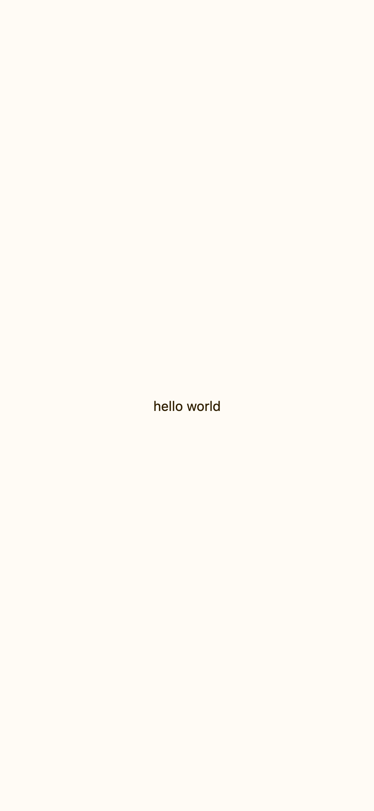

---
# Static and dynamic content mixed!
# Use the shortcode  to include the content of the file as a go-code block.
title: Tutorial 01
prev: /docs/examples
next: /docs/examples/tutorial-02-combining-views
---

Write some static content.

## Example


## Info
More static content.

## Image

## See also
- [Frame](../../components/layout/frame)
- [Text](../../components/basic/text)
- [VStack](../../components/layout/vstack)

