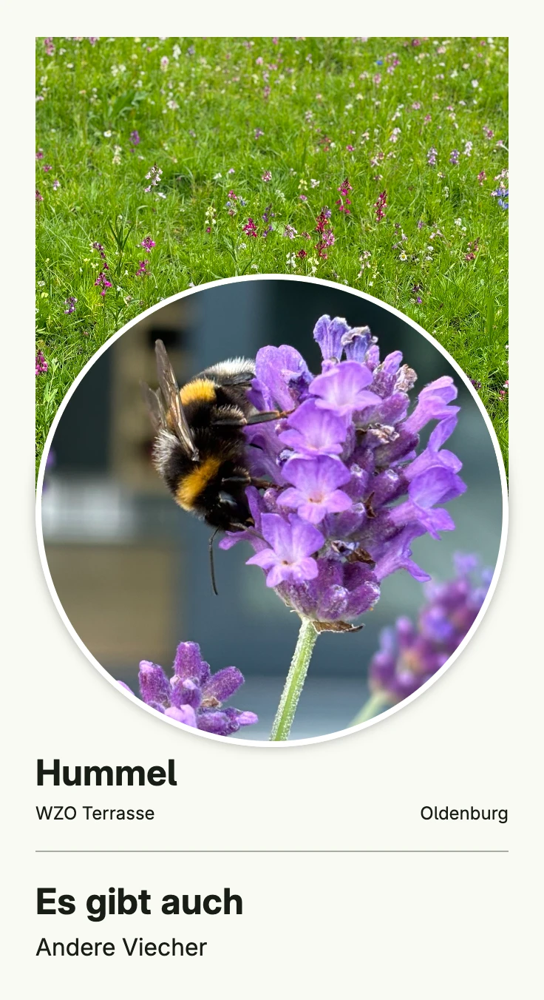

Combines images, texts and stacks into a simple profile page. The images are embedded into the binary and
served with `cfg.Resource`. The test file shows how to benchmark the rendering of a view.


