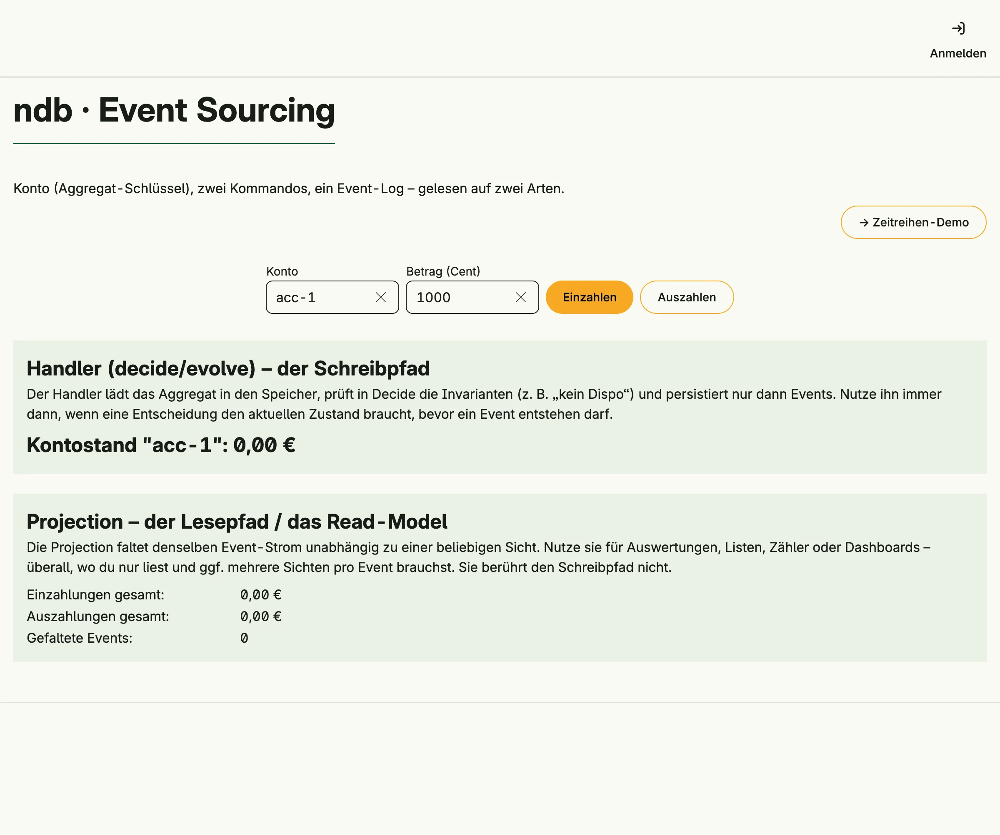

The embedded ndb database, opened with `cfg.NDB()`. One page uses a message store for event sourcing, with an `evs.Handler` as write path and an `evs.Projection` as read model. Another page stores a time series with tsdb and reduces it with `timeseries.M4` for a line chart.


