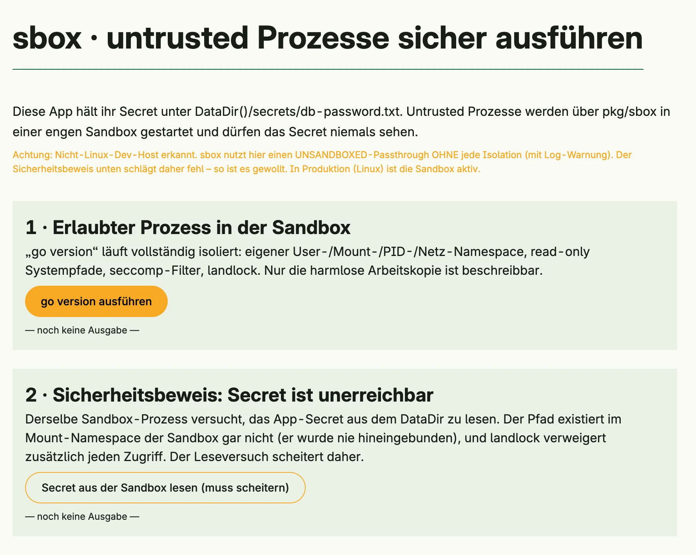

How to run untrusted processes with `pkg/sbox` so that they cannot read the data directory of the app. `sbox.Init()` must be the first statement in `main`. The sandbox needs Linux; on other systems sbox runs the process without isolation and logs a warning.


