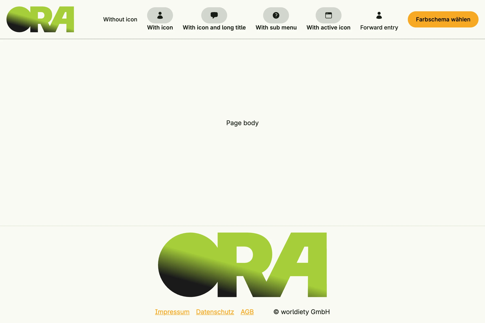

Builds the application frame with `Scaffold`: logo, menu entries with icons and sub menus, a bottom view and a
footer with legal links. A second root view uses the scaffold builder `cfg.NewScaffold` instead.


