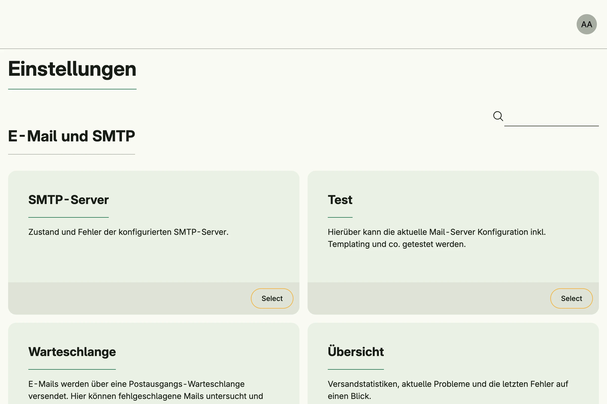

Declares two entity types and enables a generic admin UI for each with `cfgent.Enable`. Sign in as admin,
create a role with all permissions and assign it to yourself; the admin center then shows the cards for Person
and Hobby.


