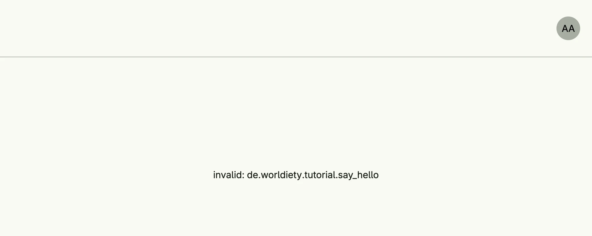

Enables the standard systems with user circles, declares a permission which a use case audits, and configures
the consents users accept at registration. As long as nobody has granted you the custom permission, the page
shows the failed audit.


