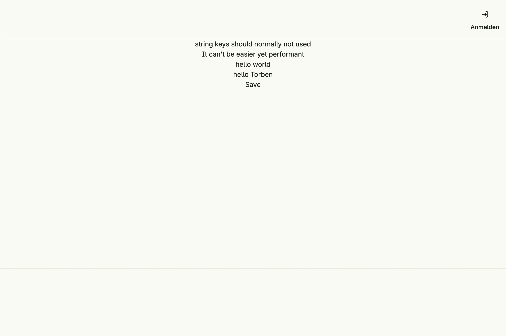

How to declare localized strings with `i18n.MustEnglish`, `i18n.MustString` and `i18n.MustVarString`, including hints for translators and variables. The localization system lets you edit the translations in the admin center.


