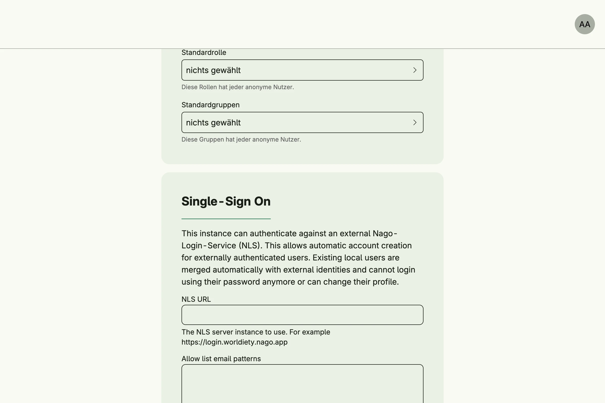

A minimal app with the standard systems. Single sign-on is configured at runtime: in the admin center, the user settings take the URL of a Nago Login Service (NLS), an allow list of email patterns and the default roles and groups of new SSO users.


