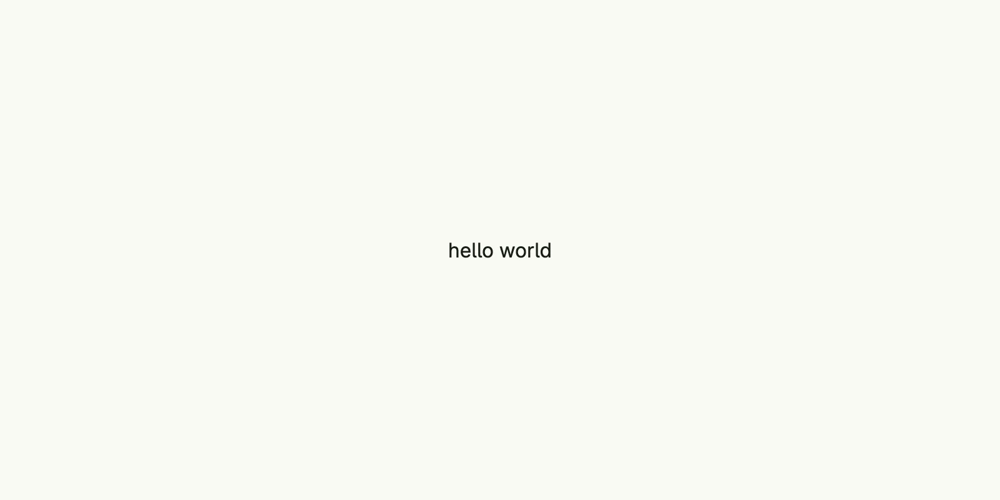

This page walks you through
[tutorial-01-helloworld](https://github.com/worldiety/nago/tree/main/example/cmd/tutorial-01-helloworld), the
smallest complete Nago application.

## The code

Put the following into `main.go` of the module you created during [installation](../installation/):



{}

### Configure

`application.Configure` creates the application and calls your function with an `*application.Configurator`.
Everything an application consists of is registered here: its identity, the frontend, the pages and the
[systems](/docs/systems/) you need. See [Application and configurator](../../concepts/application/).

### Set the application ID

`SetApplicationID` gives the application a unique, reverse-DNS-like identifier such as `com.example.myapp`.
Nago uses it for the name of the data directory, so do not change it once your application stores data.

### Serve the frontend

`cfg.Serve(vuejs.Dist())` serves the compiled Vue.js frontend which is embedded in the Nago module. Without it,
the browser gets no user interface.

### Register a root view

`cfg.RootView(".", ...)` registers the page for the path `.`, which is the start page at `/`. The factory gets the
`core.Window` of the browser tab and returns the view tree to display: a `VStack` with a `Text`, whose `Frame`
matches the screen so that the text is centered. Nago calls this factory again whenever the page must be
rendered, see [Views](../../concepts/views/) and [State and rendering](../../concepts/state/).

### Run

`Run` starts the web server and blocks until the process receives `SIGINT` or `SIGTERM`, e.g. by Ctrl+C.

{}

The tutorial dot-imports `go.wdy.de/nago/presentation/ui`, so you can write `VStack` instead of `ui.VStack`.
Most tutorials do this; whether you do is a matter of taste.

## Run it

```bash
go mod tidy
go run .
```

Open [http://localhost:3000](http://localhost:3000):



By default, the server listens on `localhost` port `3000`. Set the environment variables `HOST` and `PORT` to
change this, e.g. `PORT=8080 go run .`. All settings are described in
[Configuration and deployment](../../concepts/deployment/).

## Where your data lives

Even hello world gets a private data directory. Unless configured otherwise, it is
`~/.nago/<application ID>`, here `~/.nago/de.worldiety.tutorial_01`. All stores, files and keys of your
application land there. Delete the directory to start from scratch. See
[Persistence](../../concepts/persistence/) for its layout.

## Next steps

- Read the [Concepts](../../concepts/) to understand views, state, navigation and permissions.
- Browse the [Components](/docs/components/) for the available building blocks.
- Enable built-in [Systems](/docs/systems/) like user management and the admin center.
- Learn from the [Examples](/docs/examples/). Good next tutorials are
  [combining views](/docs/examples/tutorial-02-combining-views/),
  [buttons](/docs/examples/tutorial-11-buttons/),
  [text fields](/docs/examples/tutorial-12-textfield/) and
  [root views](/docs/examples/tutorial-46-rootviews/).
