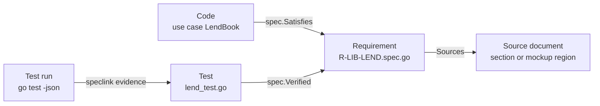

## The problem

Every project starts with a clear picture: a document says what the system must do, the code does it, the tests
show it, and the architecture is clean. A year later, the picture has faded.

- **Requirements, code, tests and documentation drift apart.** The specification is a Word document or a wiki
  page. Nobody updates it when the code changes, because nothing breaks when they don't. After a while nobody trusts
  it, and the code becomes the only truth, readable only by developers.
- **Nobody can say why code exists.** A use case refuses an action. Is this a requirement, a decision somebody made
  for a reason, or a bug? The person who knew has left. The cautious answer is to leave everything as it is, and the
  system can no longer change.
- **Nobody can say what a change affects.** The customer rewrites a paragraph of the specification. Which code
  does that reach? A developer changes a use case. Which promises to the customer does that touch? Without links
  between the two, the answer is a guess.
- **The architecture erodes.** Every team, sometimes every developer, has its own idea of where code belongs. A
  view reads the database directly because it was quicker. Reviews catch some of it, warnings in a linter are
  ignored once there are a hundred of them.
- **AI agents make all of this faster.** A coding agent writes plausible code at a speed nobody can read in full.
  Review turns into sampling, so "somebody understood this change" no longer follows from "it was merged". Asking
  another model to check the first does not help much: a model judging output like its own is not an independent
  control.

Links between requirements and code are nothing new; requirement management tools have kept them for decades. But
those links are strings in a separate tool, which the compiler never sees. Strings rot silently.

## The idea

speclink starts from one observation: a tool which reads the program can find out a lot by itself. That a type is
a use case, that a struct is an event, that a constant is a permission. The one thing no analysis can find out is
**which requirement a piece of code was written for**. That is a fact about intent, and it is not in the code.

So that is the one thing you write down, and you write it in Go:

```go
var _ = spec.For[LendBook](
	spec.Satisfies(fun.RLibLend, dec.RDecBorrower),
)
```

`fun.RLibLend` is a Go variable, the requirement. If somebody deletes or renames it, the build breaks. The link
cannot become a dangling string. Everything speclink can infer, you do not annotate; annotating it anyway is an
error, because a fact written twice is a fact which will disagree with itself one day.

## How speclink addresses the problem

### A quality gate without exceptions

`speclink verify` runs after `go build` and either reports zero findings or fails, just like the compiler. There
are no warnings, no severities and no tolerance mode, because warnings meant for a migration become a permanent
backlog. The only escape is `spec.Waive(rule, reason)` on a single construct, and the reason is mandatory and
appears in the report.

An existing code base is brought in **package by package** with the `scope` setting, not rule by rule. "This package
is not under speclink yet" is a true statement; "this rule half applies here" is not. A restricted run says how many
packages it did not measure.

### One architecture from one definition

The rules of the [architecture](../../architecture/) are not a wiki page but part of the profile `go_nago_ddd1`,
compiled into speclink. Every project which names the profile gets the same rules, and every finding explains what
is wrong, why, and how to fix it. A developer moving between projects finds use cases, permissions and views in the
same places. A project cannot quietly assemble its own variant; deviations are limited to a few layout settings in
`speclink.json`.

### Traceability in both directions

speclink measures four directions, and all four must reach 100%:

| Figure       | Question                                                                      |
|--------------|-------------------------------------------------------------------------------|
| *accounted*  | Did every section of the source documents become a requirement?               |
| *bound*      | Does every use case, command, event and projection name a requirement?        |
| *covered*    | Is every normative requirement satisfied by at least one piece of code?       |
| *verified*   | Does a test claim to demonstrate each normative requirement?                  |



Claims and evidence are kept apart. A `spec.Verified` call in a test is only a claim; it may sit behind a condition
which never holds. Only a passing test run, handed to `speclink evidence`, counts as evidence. The summary shows
both, so you can see when a test exists but has not been seen passing.

### Explainability

Because the requirements are Go values, they are compiled into your application. A Nago application can list them
at run time and answer "why does the system do this?" with the requirement, its rationale and what the decision
costs. The [Requirements system](/docs/systems/speclink_management/) shows them in the admin center, and the AI
assistant of [tutorial-113](/docs/examples/tutorial-113-ai-assistant/) uses them to explain a refusal instead of
inventing a reason.

Decisions are requirements of their own kind. A decision must state its rationale **and** its consequences, i.e.
what it makes worse. The consequences are the part nobody writes unprompted, and the part that stops somebody
three years later from starting an improvement which was already considered and rejected.

### Derived documents for review

`speclink generate` derives the specification from the code: every requirement with its wording, where it came
from, what implements it, what demonstrated it and who reviewed it, plus a list of everything missing. Markdown is
the default, because it renders everywhere and diffs well. For an auditor or a customer there is Typst output,
which compiles into a PDF with title page, table of contents and diagrams. As long as a hand-written
specification exists beside the code, it is one more thing to keep in step; a derived one cannot fall behind.

### Impact analysis

`speclink impact` walks the chain from a source section to its requirements to the code, or backwards from a file
to the requirements it touches. It answers "the customer changed section 8, what do we have to look at?" and "this
merge request changes `uc_lend_book.go`, which promises does that touch?".

### Drift detection

Renaming a requirement breaks the build, but rewording it does not: the identifier stays, every link still
compiles, coverage stays at 100%. speclink therefore records the wording of each requirement and each source
section in `speclink.lock`. If one changes, it reports the code and tests which were written for the old words.
Re-read, adjust, run `speclink freeze`, and the diff of the lock file is the review. The same mechanism protects
[stored data shapes](../../architecture/stored-shapes/).

### Working with AI coding agents

speclink does not generate code and does not prompt a model. It is indifferent to who wrote the code, which is the
point: a person and an agent are held to the same gate. The findings are written to be acted on, each with a
`How:` line, and `-format json` gives an agent the same findings in machine-readable form. An agent iterates until
the build is green, and green means the architecture, the links and the evidence are in order.

Who wrote code and who has read it is recorded from outside the code with `speclink attest` and
`speclink freeze -reviewer`, never declared in the source. A claim of human review written by the same machine
which wrote the code would prove nothing.

## What speclink does not do

speclink checks the trace, the structure and the evidence: that a requirement exists and comes from a document,
that code names it, that a test claimed it and passed. It does not check that the code does the right thing.
That remains a human judgement, which is why reviews are recorded.
