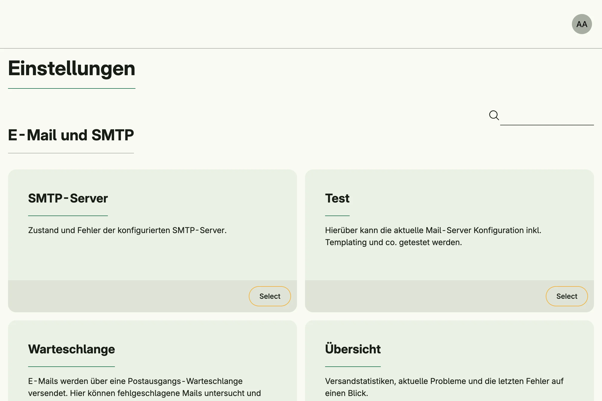

Admin Management provides the admin center at `/admin`. It collects the administration pages of all enabled
systems as cards, grouped by topic, and shows each user only the cards they have the permission for. A search
field filters the cards by title and text. Users reach the admin center from the account menu.



## Enable

```go
admin := std.Must(cfg.AdminManagement()) // application.AdminManagement
```

Admin Management is always enabled, because [Session Management](../session_management/) depends on it.

`application.AdminManagement` has the fields:

- `FindAll admin.FindAllGroups`: all groups and cards which are visible to a subject.
- `QueryGroups admin.QueryGroups`: like `FindAll`, but filtered by a search text.
- `Pages uiadmin.Pages` with the path `AdminCenter` (`admin`).

## Add your own cards

Register a callback with `AddAdminCenterGroup`. It is called for each request with the current subject:

```go
cfg.AddAdminCenterGroup(func(subject auth.Subject) admin.Group {
	return admin.Group{
		Title: "Library",
		Entries: []admin.Card{
			{
				Title:      "Books",
				Text:       "Manage the book inventory.",
				Target:     "admin/books",
				Permission: PermFindAllBooks,
			},
		},
	}
})
```

If a card sets a `Role` or a `Permission`, the subject must have it; a card without both is shown to every
signed-in user. Cards with an empty `Target` are dropped. Groups with the same title returned by different callbacks are
merged, groups and cards are sorted by title. Return an empty `admin.Group` to hide a group.

To replace the default behavior, mutate the system with `WithAdminManagement`:

```go
cfg.WithAdminManagement(func(m *application.AdminManagement) {
	// replace m.FindAll, m.QueryGroups or m.Pages
})
```

## Permissions

Admin Management declares no permissions. Opening `/admin` only requires a signed-in user, the visibility of
each card is controlled by its own permission.

## Related

Every tutorial which calls `cfg.StandardSystems()` has an admin center, for example
[built-in IAM](/docs/examples/tutorial-26-buildin-iam/).
