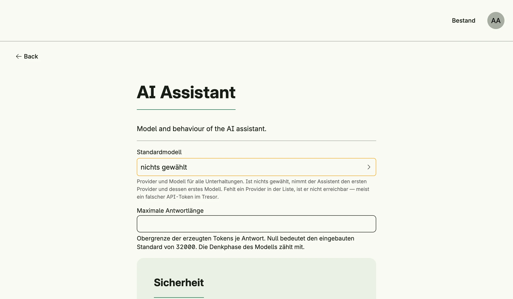

AI Management connects your application to large language models. It provides provider-independent chat
sessions with a persisted history, agentic runs with tools, and a ready-made assistant: a floating chat button
on every page which acts with the permissions of the current user. Providers for Anthropic, OpenAI-compatible
servers (including Ollama) and a local llama.cpp runtime are included.



## Enable

```go
import (
	cfgai "go.wdy.de/nago/application/ai/cfg"
	_ "go.wdy.de/nago/application/ai/provider/anthropic" // link each provider you want to offer
)

ai := std.Must(cfgai.Enable(cfg)) // cfgai.Management
```

Providers register themselves when their package is linked: blank-import
`go.wdy.de/nago/application/ai/provider/anthropic`, `.../openai` or `.../gollama`. AI Management enables
[Secret](../secret_management/) and [Settings](../settings_management/) Management and declares the system
role *AI Assistant User*.

`cfgai.Management` has the fields:

- `UseCases ai.UseCases`: the configured providers,
- `SessionUseCases session.UseCases`: persisted chat sessions,
- `Assistant *cfgai.Assistant`: the ready-made assistant.

## Configure a provider

1. Create a secret of the provider type (e.g. *Anthropic*) with the API token in the vault.
2. Share it with the group *System*.
3. Optionally choose the default model and limits in the admin center under *Einstellungen* →
   *AI Assistant*.

Providers are reloaded automatically when a secret changes.

## Nago AI Service

Instead of keeping provider credentials in every instance, an instance can use the Nago AI Service (NAIS), a gateway
to several providers, which counts the tokens of every instance for the billing. Link its package:

```go
import _ "go.wdy.de/nago/application/ai/provider/nais"
```

The provider *Nago AI Service* then appears by itself, no secret is needed: the instance enrolls like with the Nago
Mail Service. A public https origin is called back under `/api/nago/v1/ai/nonce/`, a local instance like
`http://localhost:3000` is admitted if it calls from an address the service knows. The service decides which models
the instance may call and which is its default.

| Variable | Meaning |
|---|---|
| `NAGO_AI_SERVICE` | Endpoint of the service, default `https://ai.worldiety.nago.app`. `off` disables it. |
| `NAGO_AI_SERVICE_TOKEN` | Optional refresh token issued by the operator of the service, for instances that cannot enroll themselves. |

The service speaks the Messages API of Anthropic, so the provider is the Anthropic provider pointed at the service,
including streaming and files.

## Decorate every provider

An application that meters or limits the use of AI per subject wraps every provider, those of the vault as well as
services like the Nago AI Service:

```go
ai, err := cfgai.Enable(cfg)
// ...
if err := ai.DecorateProviders("usage", func(p provider.Provider) (provider.Provider, error) {
	return aiusage.Wrap(store, p), nil
}); err != nil {
	return err // refuse to start without metering
}
```

The providers are reloaded at once, and an error of the decorator is returned. Registering the same name again
replaces the decorator instead of wrapping twice. Later reloads, e.g. after a secret changed, decorate again and
leave out a provider its decorator fails on. A decorator must keep the identity of the provider, must keep its state,
like counters, outside of the wrapper, and should also account a stream its consumer stops early. Resolve providers
by their id whenever needed instead of keeping them, and check after configuring with `FindAllProvider` that every
provider is wrapped, if an unmetered call must never happen.

## Add the assistant

Decorate every page with the assistant button:

```go
scaffold := cfg.NewScaffold().Decorator()
cfg.SetDecorator(func(wnd core.Window, view core.View) core.View {
	return scaffold(wnd, ai.Assistant.Decorate(wnd, view, cfgai.AssistantOptions{
		Title:   "Assistant",
		History: true,
	}))
})
```

`AssistantOptions` also sets agents with their tools and system prompts, file upload, confirmation of
mutating tools and the position of the button. Users need the role *AI Assistant User*
(`cfgai.RoleAssistantUser`); without it, without a provider or when an operator hides the assistant, the
view is returned unchanged and the reason is logged.

## Use cases

| Use case                                   | Description                                                   |
|--------------------------------------------|---------------------------------------------------------------|
| `UseCases.FindAllProvider`                 | Lists the configured providers.                               |
| `UseCases.FindProviderByID`, `FindProviderByName` | Look up a provider.                                    |
| `UseCases.ReloadProvider`                  | Rebuilds the providers from the vault.                        |
| `SessionUseCases.Create`                   | Creates a chat session.                                       |
| `SessionUseCases.FindByID`, `FindAll`      | Load sessions visible to the subject.                         |
| `SessionUseCases.Append`                   | Adds a user message and runs the completion, agentic when tools are set. |
| `SessionUseCases.Resolve`                  | Answers a pending question or tool approval and continues.    |
| `SessionUseCases.Dismiss`                  | Closes pending decisions and cancels background tasks.        |
| `SessionUseCases.Rename`, `Delete`         | Rename or delete a session.                                   |

## Permissions

| Permission                      | Allows to                         |
|---------------------------------|-----------------------------------|
| `nago.ai.provider.find_all`     | list providers                    |
| `nago.ai.provider.find_by_id`   | view a provider                   |
| `nago.ai.provider.find_by_name` | view a provider by name           |
| `nago.ai.provider.reload`       | reload providers                  |
| `nago.ai.model.find_all`        | list models                       |
| `nago.ai.session.create`        | create sessions                   |
| `nago.ai.session.find_by_id`    | view a session                    |
| `nago.ai.session.find_all`      | list sessions                     |
| `nago.ai.session.append`        | send messages, answer decisions   |
| `nago.ai.session.rename`        | rename sessions                   |
| `nago.ai.session.delete`        | delete sessions                   |

The system role `nago.ai.assistant.user` contains `provider.find_all`, `model.find_all` and
`session.create`. It grants no access to business data: the assistant acts with the permissions of its user.
Sessions are registered as a [ReBAC](../rebac_management/) resource.

## UI

AI Management has no admin page of its own. Providers are configured in the
[vault](../secret_management/), the assistant in the settings card *AI Assistant*.

## Related

- [Tutorial: AI](/docs/examples/tutorial-77-ai/) shows sessions, agentic runs, file upload and drive tools.
- [Tutorial: AI assistant](/docs/examples/tutorial-113-ai-assistant/) adds the assistant to a complete
  application, together with [requirements](../speclink_management/).
