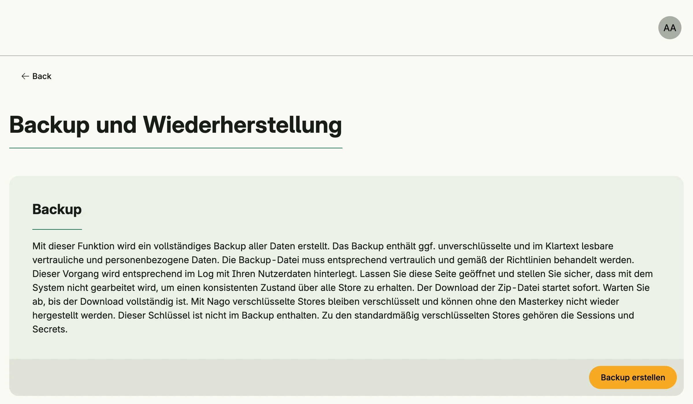

Backup Management saves the complete data of the application into a zip file and restores it. It also
exports and replaces the master key, which encrypts sensitive stores such as sessions and secrets.



## Enable

```go
backups := std.Must(cfg.BackupManagement()) // application.BackupManagement
```

`cfg.StandardSystems()` enables Backup Management. It has the fields `UseCases backup.UseCases` and
`Pages uibackup.Pages` with the path `BackupAndRestore`.

## Master key

The master key is read from the environment variable `NAGO_MASTER_KEY` (64 hex characters). Without it, Nago
generates a key and stores it in the file `.masterkey` in the data directory. A backup does not contain the
master key: encrypted stores stay encrypted and can only be restored with the same key. Keep the key in a
safe place, separate from the backups.

## Use cases

| Use case           | Description                                                                          |
|--------------------|--------------------------------------------------------------------------------------|
| `Backup`           | Writes a zip with all stores. Encrypted stores stay encrypted.                        |
| `Restore`          | Restores the stores from a backup and overwrites existing data. Stores which are not in the backup stay unchanged. |
| `ExportMasterKey`  | Returns the master key as hex.                                                       |
| `ReplaceMasterKey` | Writes a new master key into `.masterkey`; it takes effect after a restart.          |

`backup.AsBackupFile` wraps `Backup` into a downloadable file named `backup_<time>.zip`.

## Permissions

| Permission                      | Allows to                  |
|---------------------------------|----------------------------|
| `nago.backup.backup`            | create backups             |
| `nago.backup.restore`           | restore backups            |
| `nago.backup.masterkey.export`  | export the master key      |
| `nago.backup.masterkey.replace` | replace the master key     |

## UI

The page `admin/backup-and-restore` creates and restores backups and manages the master key. The admin center
shows the card *Backup und Wiederherstellung* in the group *System*.
