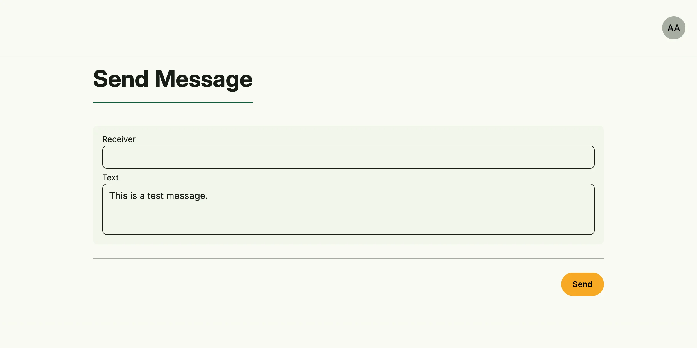

Chatbot Management sends direct messages to users of a chat system through a bot account, currently
Mattermost. Recipients are addressed by their user ID or mail address. Messages are not queued: if sending
fails, the error is returned.



## Enable

```go
import cfgchatbot "go.wdy.de/nago/application/chatbot/cfg"

chat := std.Must(cfgchatbot.Enable(cfg)) // cfgchatbot.Management
```

Chatbot Management enables [Secret Management](../secret_management/). `cfgchatbot.Management` has the fields
`UseCases chatbot.UseCases` and `Pages uichatbot.Pages` with the path `Send`.

## Configure a provider

Create a secret of the type *Mattermost Chatbot* with the server URL and the bot token in the vault and share
it with the group *System*.

## Use cases

| Use case         | Description                                                                         |
|------------------|-------------------------------------------------------------------------------------|
| `Send`           | Sends a direct message (`message.SendRequested`) to a user, found by ID or mail.     |
| `ReloadProvider` | Rebuilds the providers from the vault, also done automatically.                     |

Publishing a `message.SendRequested` on the event bus sends it as the system user.

## Permissions

| Permission                     | Allows to             |
|--------------------------------|-----------------------|
| `nago.chatbot.provider.send`   | send messages         |
| `nago.chatbot.provider.reload` | reload the providers  |

## UI

`admin/chatbot/send` sends a test message. The admin center shows it as *Send message* in the group
*Chatbot*.

## Related

- [Tutorial: chatbot](/docs/examples/tutorial-82-chatbot/)
