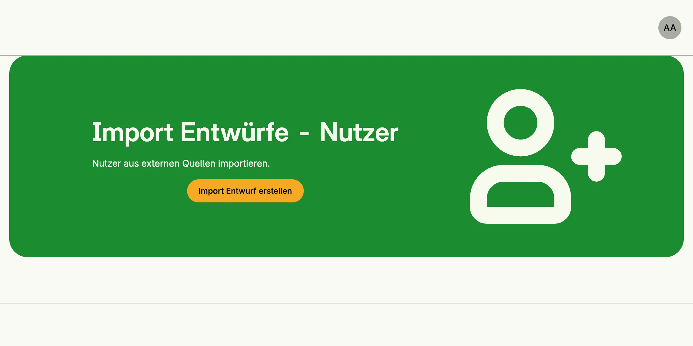

Data Import Management imports external data, such as CSV, JSON or PDF forms, into your application. A
*parser* reads the raw data into entries of a *staging*, a draft batch. In the admin UI an administrator maps
the source fields to the target fields, reviews, corrects, confirms or ignores single entries and finally
starts the import. An *importer* writes the entries into your domain.



## Enable

```go
import cfgdataimport "go.wdy.de/nago/application/dataimport/cfg"

imports := std.Must(cfgdataimport.Enable(cfg)) // cfgdataimport.Management
```

`cfgdataimport.Management` has the fields `UseCases dataimport.UseCases` and `Pages uidataimport.Pages`.

Parsers and importers are not registered automatically. Register the built-in ones and your own at startup:

```go
import (
	"go.wdy.de/nago/application/dataimport/importer/userimporter"
	"go.wdy.de/nago/application/dataimport/parser/csv"
)

option.MustZero(imports.UseCases.RegisterParser(user.SU(), csv.NewParser()))
option.MustZero(imports.UseCases.RegisterImporter(user.SU(), userimporter.NewImporter(std.Must(cfg.UserManagement()).UseCases)))
```

Built-in parsers: `csv.NewParser()`, `json.NewParser()` (also JSON lines) and `pdf.NewParser()` (PDF
AcroForms), in `go.wdy.de/nago/application/dataimport/parser/...`. The built-in importer
`userimporter.NewImporter` creates users. Implement `parser.Parser` or `importer.Importer` for your own
formats and targets.

## Use cases

| Use case                       | Description                                                       |
|--------------------------------|-------------------------------------------------------------------|
| `RegisterParser`, `RegisterImporter` | Register a parser or importer.                              |
| `FindParsers`, `FindImporters`, `FindImporterByID` | List the registered parsers and importers.    |
| `CreateStaging`                | Creates a staging for an importer.                                |
| `FindStagingByID`, `FindStagingsForImporter` | Load stagings.                                      |
| `DeleteStaging`                | Deletes a staging and its entries.                                |
| `Parse`                        | Parses raw data into entries of a staging.                        |
| `FilterEntries`, `FindEntryByID` | Load entries of a staging.                                      |
| `UpdateStagingTransformation`  | Sets the mapping from source fields to target fields.             |
| `UpdateEntryConfirmation`      | Marks an entry as reviewed.                                       |
| `UpdateEntryIgnored`           | Excludes an entry from the import.                                |
| `UpdateEntryTransformed`       | Overrides the transformed result of an entry.                     |
| `CalculateStagingReviewStatus` | Counts total, confirmed, ignored and imported entries.            |
| `Import`                       | Runs the importer for a staging.                                  |

## Permissions

| Permission                                      | Allows to                         |
|-------------------------------------------------|-----------------------------------|
| `nago.dataimport.parser.register`               | register parsers                  |
| `nago.dataimport.importer.register`             | register importers                |
| `nago.dataimport.findparsers`                   | list parsers                      |
| `nago.dataimport.findimporter`                  | list importers                    |
| `nago.dataimport.createstaging`                 | create stagings                   |
| `nago.dataimport.findstaging`                   | view stagings                     |
| `nago.dataimport.deletestaging`                 | delete stagings                   |
| `nago.dataimport.parse`                         | parse data                        |
| `nago.dataimport.filterentries`                 | list entries                      |
| `nago.dataimport.findentrybyid`                 | view an entry                     |
| `nago.dataimport.updatestagingtransformation`   | change the field mapping          |
| `nago.dataimport.entry.updateconfirmation`      | confirm entries                   |
| `nago.dataimport.entry.updateignored`           | ignore entries                    |
| `nago.dataimport.entry.updatetransformed`       | override entries                  |
| `nago.dataimport.entry.calculatestagingstatus`  | calculate the review status       |
| `nago.dataimport.import`                        | run the import                    |

## UI

The admin center shows a card per registered importer in the group *Daten Importe*. It leads to
`admin/data/stagings?importer=<id>`; the other pages are `admin/data/select-parser`, `admin/data/staging`
and `admin/data/entry`.

## Related

- [Tutorial: data importer](/docs/examples/tutorial-62-dataimporter/)
