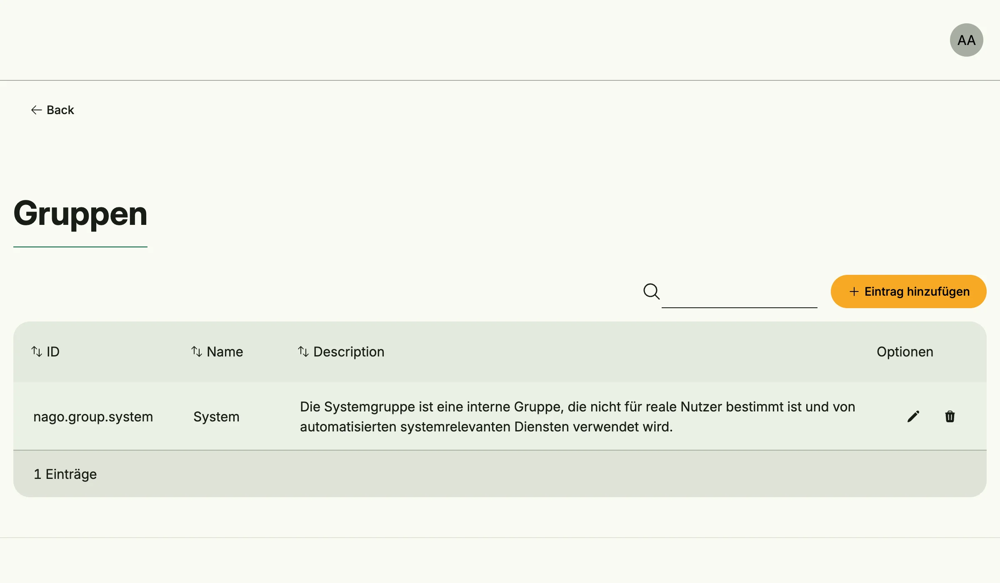

Group Management creates and maintains user groups. A group bundles users, for example a department, and is
used to share resources such as [secrets](../secret_management/) or drive files with all of its members.
Unlike a [role](../role_management/), a group carries no permissions of its own. Memberships are managed in
[User Management](../user_management/).



## Enable

```go
groups := std.Must(cfg.GroupManagement()) // application.GroupManagement
```

Group Management is always enabled, because User Management depends on it. It has the fields
`UseCases group.UseCases` and `Pages uigroup.Pages` with the path `Groups`.

On every start the system group `group.System` (`nago.group.system`) is created or updated. It is meant for
internal services, not for real users: for example, an SMTP server secret must be shared with it to be used
by [Mail Management](../mail_management/).

## Use cases

| Use case       | Description                                        |
|----------------|----------------------------------------------------|
| `FindByID`     | Loads a group.                                     |
| `FindAll`      | Lists all groups.                                  |
| `Create`       | Creates a group.                                   |
| `Update`       | Updates a group.                                   |
| `Upsert`       | Creates or updates a group by its ID.              |
| `Delete`       | Deletes a group.                                   |
| `FindMyGroups` | Lists the groups the subject is a member of.       |

The events `group.Updated` and `group.Deleted` are published.

## Permissions

| Permission            | Allows to        |
|-----------------------|------------------|
| `nago.group.find_by_id` | view a group   |
| `nago.group.find_all` | list all groups  |
| `nago.group.create`   | create groups    |
| `nago.group.update`   | update groups    |
| `nago.group.delete`   | delete groups    |

## UI

The page `admin/groups` lists, creates, edits and deletes groups. The admin center shows the card *Gruppen*
in the group *Nutzerverwaltung*.

## Related

- [User Management](../user_management/) assigns users to groups.
- [ReBAC](../rebac_management/) lists groups as a resource.
