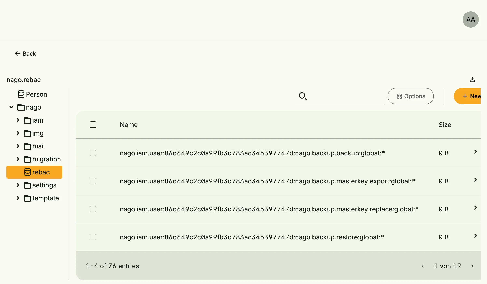

The inspector is a maintenance tool for administrators and developers. It browses all entity and blob stores of
the application, shows, edits, downloads and deletes entries. If an ndb database is configured, it also
inspects its message streams and time series.



## Enable

```go
import cfginspector "go.wdy.de/nago/application/inspector/cfg"

inspector := std.Must(cfginspector.Enable(cfg)) // cfginspector.Management
```

`cfginspector.Management` has the fields:

- `UseCases inspector.UseCases` and `Pages uiinspector.Pages` for the stores,
- `NDBUseCases inspectorndb.UseCases` and `NDBPages uindbinspector.Pages` for ndb databases.

## Use cases

| Use case  | Description                                                                 |
|-----------|-----------------------------------------------------------------------------|
| `FindAll` | Lists all stores with their name and kind (entity or blob store).           |
| `Filter`  | Lists the entries of a store page by page, optionally with content preview. |

The ndb use cases list databases, message types and time series, read windows of messages or data points and
offer maintenance operations like deleting messages or rebuilding the time index.

Stores can be downloaded as JSON or zip through `/api/nago/v1/inspector/download/...`.

## Permissions

| Permission            | Allows to                                         |
|-----------------------|---------------------------------------------------|
| `nago.data.inspector` | view, edit and delete the data of all stores      |
| `nago.ndb.inspector`  | inspect and maintain ndb databases                |


`nago.data.inspector` bypasses every other permission of the application. Grant it only for maintenance.


## UI

| Path                             | Page                  |
|----------------------------------|-----------------------|
| `admin/inspector`                | stores                |
| `admin/inspector/ndb/messages`   | ndb message streams   |
| `admin/inspector/ndb/timeseries` | ndb time series       |

The admin center shows the card *Stores* in the group *Inspektor*, and the ndb cards once an ndb database is
registered.

## Related

- [Tutorial: admin stores](/docs/examples/tutorial-57-adm-stores/)
- [Tutorial: ndb](/docs/examples/tutorial-103-ndb/)
