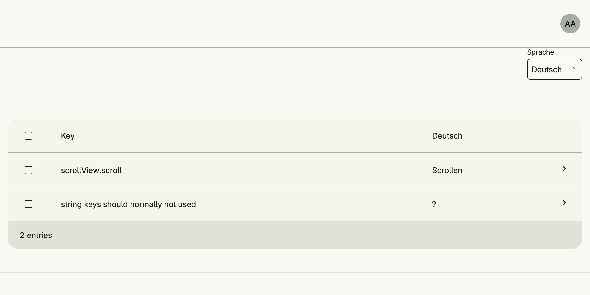

Localization Management lets administrators translate the texts of the application at runtime. It shows all
localizable strings of Nago and of your application, grouped by their key, and how many are not translated
yet. Translations are stored and loaded into the global i18n resources at startup.



## Enable

```go
import cfglocalization "go.wdy.de/nago/application/localization/cfg"

loc := std.Must(cfglocalization.Enable(cfg)) // cfglocalization.Management
```

`cfglocalization.Management` has the fields `UseCases localization.UseCases` and `Pages uilocalization.Pages`
with the paths `PageDirectory`, `PageMessage` and `PageLanguage`.

How to declare localizable strings in code is described in the localization concept; see the tutorial below.

## Use cases

| Use case         | Description                                                                         |
|------------------|-------------------------------------------------------------------------------------|
| `ReadDir`        | Returns a level of the key hierarchy with the number of total and missing translations. |
| `ReadStringKeys` | Lists the string keys, i.e. keys which are their own default text.                  |
| `FindResources`  | Returns the underlying i18n resources.                                              |
| `UpdateMessage`  | Stores the translation of a message for a language.                                 |
| `Flush`          | Applies updated translations to the running application.                            |
| `AddLanguage`    | Adds a target language.                                                             |

## Permissions

| Permission                         | Allows to                   |
|------------------------------------|-----------------------------|
| `nago.localization.readdir`        | browse localizable texts    |
| `nago.localization.updatemessage`  | update translations         |
| `nago.localization.addlanguage`    | add languages               |

## UI

`admin/localization/directory` browses the keys, `admin/localization/message` edits a translation and
`admin/localization/language` adds a language. The admin center group *Translations* has a card per top-level
key, a card for the string keys and a card for the languages.

## Related

- [Tutorial: localization](/docs/examples/tutorial-74-localization/)
