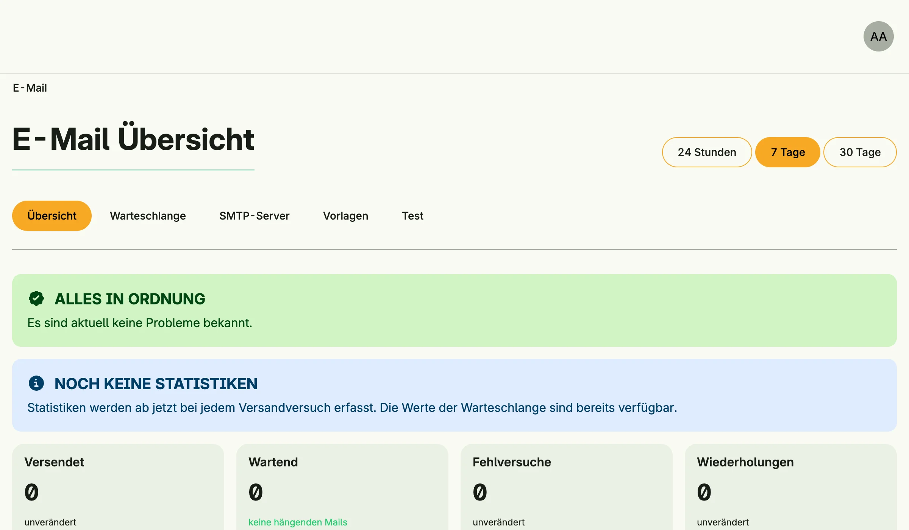

Mail Management sends e-mails, for example the verification and password reset mails of
[User Management](../user_management/). Mails are put into an outgoing queue and delivered by a background
scheduler through an SMTP server, failed deliveries are retried. The admin UI shows statistics, the queue, the
health of the SMTP servers and a test form.



## Enable

```go
mails := std.Must(cfg.MailManagement()) // application.MailManagement
```

Mail Management is always enabled, because [Session Management](../session_management/) depends on it. It
enables [Secret](../secret_management/) and [Template](../template_management/) Management and installs the
built-in mail templates as a template project.

`application.MailManagement` has the fields `UseCases mail.UseCases` and `Pages uimail.Pages`.

## Configure an SMTP server

1. Open the vault in the admin center (*Tresor & Fremdsysteme*) and create a secret of the type
   *SMTP Postausgangsserver* with host, port, user, password and sender address.
2. Share the secret with the group *System* (`group.System`).

Without a shared SMTP secret, mails stay in the queue. If several SMTP secrets are shared, `Mail.SmtpHint`
selects one by name or secret ID; otherwise the first one is used.

## Send a mail

```go
import (
	netmail "net/mail"

	"go.wdy.de/nago/application/mail"
)

_, err := mails.UseCases.SendMail(subject, mail.Mail{
	To:      []netmail.Address{{Address: "jane@example.com"}},
	Subject: "Hello",
	Parts:   []mail.Part{mail.NewTextPart("Hello Jane")},
})
if err != nil {
	return err
}
```

`mail.NewHtmlPart` and `mail.NewAttachmentPart` add HTML and attachments. Code which runs without a subject
can publish a `mail.SendMailRequested` event on the event bus instead; it is sent as the system user.

The configurator has helpers for the built-in flows: `cfg.SendVerificationMail(uid)`,
`cfg.SendPasswordResetMail(mail)` and `cfg.SendMailTemplate(to, tpl, subjectName, bodyName, model)`, which
renders a [template](../template_management/) and sends it.

## Use cases

| Use case             | Description                                                              |
|----------------------|--------------------------------------------------------------------------|
| `SendMail`           | Puts a mail into the outgoing queue.                                     |
| `FindOutgoingIDs`    | Lists the IDs of outgoing mails, latest first, with an optional filter. |
| `FindOutgoingByID`   | Loads an outgoing mail with content and delivery attempts.               |
| `DeleteOutgoingByID` | Removes a mail from the queue.                                           |
| `RetryOutgoing`      | Puts mails back into the queue and keeps their attempt history.          |
| `ResendOutgoing`     | Queues a new copy of a mail.                                             |
| `Statistics`         | Aggregates delivery statistics, problems and SMTP server health.         |

`Outgoing` is deprecated, use the use cases above.

## Permissions

| Permission                       | Allows to                       |
|----------------------------------|---------------------------------|
| `nago.mail.send`                 | send mails                      |
| `nago.mail.outgoing.find_all`    | view the outgoing queue         |
| `nago.mail.outgoing.find_by_id`  | view an outgoing mail           |
| `nago.mail.outgoing.delete_by_id`| delete an outgoing mail         |
| `nago.mail.outgoing.update`      | update an outgoing mail         |
| `nago.mail.outgoing.retry`       | retry a failed delivery         |
| `nago.mail.outgoing.resend`      | resend a mail                   |
| `nago.mail.statistics`           | view statistics and SMTP health |
| `nago.mail.init_default_templates` | set the default templates     |

## UI

| Path                    | Page                          |
|-------------------------|-------------------------------|
| `admin/mail`            | dashboard with statistics     |
| `admin/mail/outgoing`   | outgoing queue                |
| `admin/mail/outgoing/detail` | a single mail            |
| `admin/mail/smtp`       | SMTP servers and their health |
| `admin/mail/test`       | send a test mail              |

The admin center shows them in the group *E-Mail und SMTP*.

## Related

- [Secret Management](../secret_management/) stores the SMTP credentials.
- [Template Management](../template_management/) holds the mail templates.
