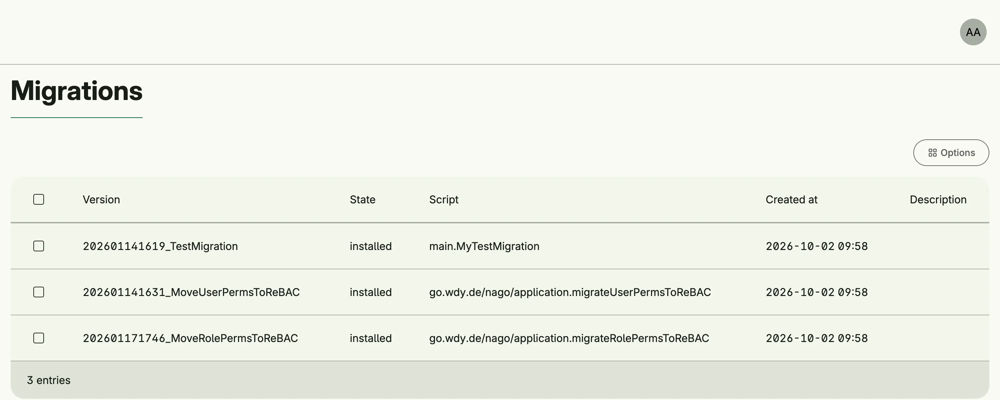

Data migrations transform stored data when your model changes. Nago applies all declared migrations at startup
in ascending version order and records their status; a failed migration aborts the start. Migrations always
run, the system described here only adds an admin page which shows their status.



## Declare a migration

A migration implements `migration.Migration` with `Version()` and `Migrate(ctx)`:

```go
type AddDefaultCategory struct{}

func (AddDefaultCategory) Version() migration.Version {
	return migration.NewVersion(2026, time.January, 14, 16, 19, "AddDefaultCategory")
}

func (AddDefaultCategory) Migrate(ctx context.Context) error {
	// transform the stored data
	return nil
}

option.MustZero(std.Must(cfg.Migrations()).Declare(AddDefaultCategory{}, migration.Options{}))
```

The version has the form `YYYYMMDDhhmm_name`. Treat an applied migration as immutable and declare a new one
for further changes. `migration.Options{Immediate: true}` applies a migration during the declaration instead
of at startup.

## Enable the admin page

```go
import cfgmigration "go.wdy.de/nago/application/migration/cfg"

mod := std.Must(cfgmigration.Enable(cfg)) // cfgmigration.Module
```

`cfgmigration.Module` has the fields `Migrations *migration.Migrations` and `Pages uimigration.Pages` with the
path `Overview`.

## Permissions

| Permission              | Allows to                       |
|-------------------------|---------------------------------|
| `nago.migration.view`   | view the status of migrations   |
| `nago.migration.reapply`| run a migration again           |

## UI

`admin/migration/overview` lists all migrations with their status. The admin center shows the card
*Overview* in the group *Migrations*.

## Related

- [Tutorial: resource based access](/docs/examples/tutorial-88-resource-based-access/) declares a migration.
