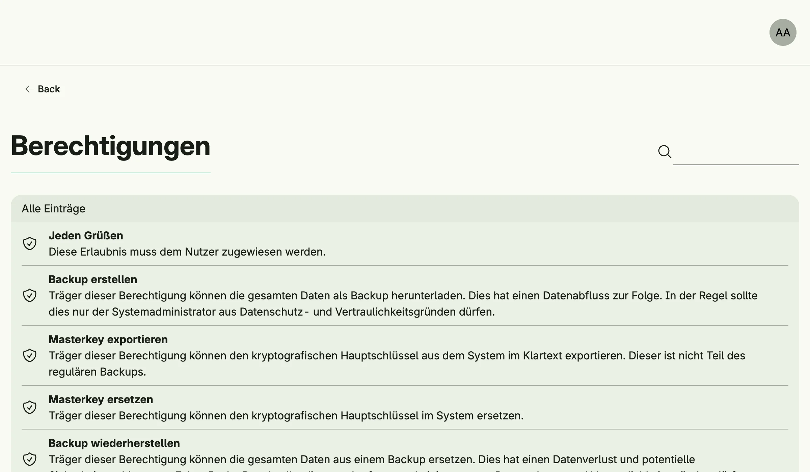

A permission is the most fine-grained unit of access control. Permissions are declared in code at development
time and cannot be created or changed at runtime. You grant them to [roles](../role_management/) or directly
to [users](../user_management/). Permission Management lists all declared permissions.



## Declare a permission

Declare one permission per use case, usually as a package variable next to it, and check it with `Audit`:

```go
var PermSayHello = permission.Declare[SayHello]("de.worldiety.tutorial.say_hello", "Say hello", "Allows to greet everyone.")

type SayHello func(subject auth.Subject) string

func NewSayHello() SayHello {
	return func(subject auth.Subject) string {
		if err := subject.Audit(PermSayHello); err != nil {
			return err.Error()
		}

		return "hello " + subject.Name()
	}
}
```

- The ID must be lower case and dot separated, e.g. `my.app.book.create`. Declaring an ID twice panics.
- The type parameter is the use case type and must be a named function type.
- `permission.DeclareCreate`, `DeclareFindByID`, `DeclareFindAll`, `DeclareUpdate`, `DeclareDeleteByID` and
  similar helpers derive English and German names from an entity name.
- `permission.All()` and `permission.Find(id)` look up declared permissions.

The [bootstrap admin](../user_management/#bootstrap-admin) only gets the `nago.*` permissions, so grant your
own permissions through a role.

## Enable

```go
perms := std.Must(cfg.PermissionManagement()) // application.PermissionManagement
```

Permission Management is always enabled. It has the fields `UseCases permission.UseCases` and
`Pages uipermission.Pages` with the path `Permissions`.

## Use cases

| Use case  | Description                                       |
|-----------|---------------------------------------------------|
| `FindAll` | Lists all declared permissions, sorted by name.   |

## Permissions

| Permission                 | Allows to                 |
|----------------------------|---------------------------|
| `nago.permission.find_all` | list all permissions      |

## UI

The read-only list `admin/permissions` shows all permissions. The admin center shows the card
*Berechtigungen* in the group *Nutzerverwaltung*.

## Related

- [Tutorial: built-in IAM](/docs/examples/tutorial-26-buildin-iam/) declares and checks a permission.
- [ReBAC](../rebac_management/) grants permissions on single resources.
