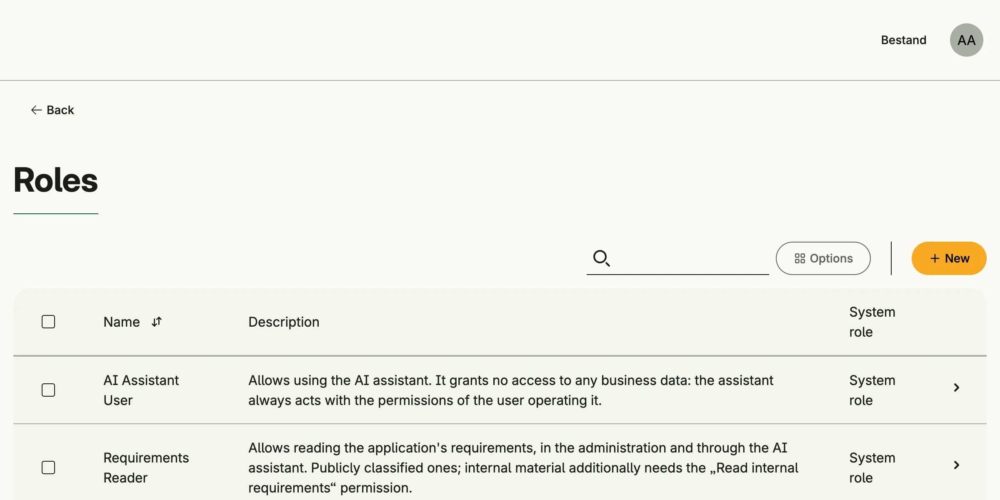

Role Management creates and maintains roles. A role bundles [permissions](../permission_management/); users
which are members of a role get all of its permissions. Role memberships are managed in
[User Management](../user_management/).



## Enable

```go
roles := std.Must(cfg.RoleManagement()) // application.RoleManagement
```

Role Management is always enabled, because User Management depends on it. It has the fields
`UseCases role.UseCases` and `Pages uirole.Pages` with the paths `Roles` and `Role`.

## System roles

Declare roles which your application needs with `DeclareSystemRole`:

```go
err := cfg.DeclareSystemRole(role.Role{
	ID:          "my.app.librarian",
	Name:        "Librarian",
	Description: "Manages the book inventory.",
}, PermCreateBook, PermDeleteBook)
```

The call is idempotent and needs a stable ID. Name and description are only written when the role is created,
afterwards they belong to the operator. The permissions are a minimum: permissions which an administrator adds
are kept. A system role cannot be deleted and its permissions cannot be replaced in the UI, but users can be
assigned to it as usual.

## Use cases

| Use case            | Description                                                                   |
|---------------------|-------------------------------------------------------------------------------|
| `FindByID`          | Loads a role.                                                                 |
| `FindAll`           | Lists all roles.                                                              |
| `Create`            | Creates a role.                                                               |
| `Update`            | Updates a role, the system flag cannot be changed.                            |
| `Upsert`            | Creates or updates a role by its ID.                                          |
| `Delete`            | Deletes a role, system roles are refused.                                     |
| `FindMyRoles`       | Lists the roles the subject is a member of.                                   |
| `ListPermissions`   | Lists the permissions of a role.                                              |
| `UpdatePermissions` | Replaces the permissions of a role, refused for system roles.                 |
| `UpsertPermissions` | Adds permissions to a role and never removes any.                             |

The events `role.Updated` and `role.Deleted` are published.

## Permissions

| Permission            | Allows to       |
|-----------------------|-----------------|
| `nago.role.find_by_id`| view a role     |
| `nago.role.find_all`  | list all roles  |
| `nago.role.create`    | create roles    |
| `nago.role.update`    | update roles    |
| `nago.role.delete`    | delete roles    |

## UI

`admin/iam/roles` lists the roles, `admin/iam/roles/role?role=<id>` edits a role and its permissions. The
admin center shows the card *Rollen* in the group *Nutzerverwaltung*.

## Related

- [Tutorial: AI assistant](/docs/examples/tutorial-113-ai-assistant/) declares a system role.
- The user settings `DefaultRoles`, `AnonRoles` and `DefaultSSORoles` assign roles automatically, see
  [User Management](../user_management/).
