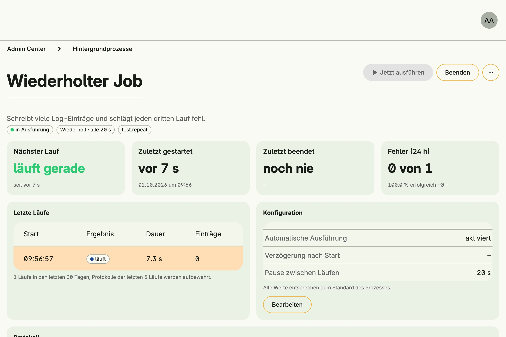

Scheduler Management runs background jobs: once after startup, repeatedly, daily at a fixed time or only on
demand. Each job is declared in code. Administrators see its state, statistics, the last runs with their logs,
start or stop it and change its schedule.



## Enable

```go
import cfgscheduler "go.wdy.de/nago/application/scheduler/cfg"

schedulers := std.Must(cfgscheduler.Enable(cfg)) // cfgscheduler.SchedulerManagement
```

`cfgscheduler.SchedulerManagement` has the fields `UseCases scheduler.UseCases` and `Pages uischeduler.Pages`
with the path `SchedulerDashboard`.

## Declare a job

```go
option.MustZero(schedulers.UseCases.Configure(user.SU(), scheduler.Options{
	ID:          "my.app.cleanup",
	Name:        "Cleanup",
	Description: "Removes expired entries.",
	Kind:        scheduler.Schedule,
	Defaults:    scheduler.Settings{PauseTime: time.Hour},
	Runner: func(ctx context.Context) error {
		scheduler.LoggerFrom(ctx).Info("cleaning up")
		return nil
	},
}))
```

| Kind       | Runs                                                                                  |
|------------|---------------------------------------------------------------------------------------|
| `OneShot`  | once, `StartDelay` after startup                                                      |
| `Schedule` | repeatedly, with `PauseTime` between runs                                             |
| `Cron`     | daily at `CronHour:CronMinute` server time; with `PauseTime`, repeatedly from then on |
| `Manual`   | only when started by hand or with `ExecuteNow`                                        |

`Defaults` are the initial settings; administrators can override them, and the overrides are persisted.
`Actions` adds custom buttons to the job page. Log with the logger from the context: each run keeps its own
log, the logs of the last 5 runs and statistics of 30 days are kept.

## Use cases

| Use case             | Description                                                    |
|----------------------|----------------------------------------------------------------|
| `Configure`          | Declares a job.                                                |
| `Reconfigure`        | Replaces the options of a job and keeps its settings.          |
| `Remove`             | Stops a job and removes it with its settings.                  |
| `ListSchedulers`     | Lists all jobs.                                                |
| `Status`             | State, last and next run, last error and statistics of a job.  |
| `ExecuteNow`         | Runs a job immediately.                                        |
| `Start`, `Stop`      | Start or stop a job until the next restart.                    |
| `FindSettingsByID`, `UpdateSettings`, `DeleteSettingsByID` | Read, change or reset the settings of a job. |
| `ListRuns`           | Lists the runs of a job, newest first.                         |
| `ViewLogs`           | Shows the log of the current run.                              |
| `ViewRunLog`         | Shows the log of a past run.                                   |

## Permissions

| Permission                             | Allows to                    |
|----------------------------------------|------------------------------|
| `nago.scheduler.configure`             | declare and reconfigure jobs |
| `nago.scheduler.remove`                | remove jobs                  |
| `nago.scheduler.listall`               | list jobs                    |
| `nago.scheduler.status`                | view state and runs          |
| `nago.scheduler.viewlogs`              | view logs                    |
| `nago.scheduler.executenow`            | run jobs immediately         |
| `nago.scheduler.start`                 | start jobs                   |
| `nago.scheduler.stop`                  | stop jobs                    |
| `nago.scheduler.settings.find_by_id`   | view settings                |
| `nago.scheduler.settings_update`       | change settings              |
| `nago.scheduler.settings.delete_by_id` | reset settings               |

## UI

The admin center shows a card per job in the group *Hintergrundprozesse*. It opens
`admin/scheduler/overview?id=<job id>`.

## Related

- [Tutorial: scheduler](/docs/examples/tutorial-61-scheduler/)
- [Tutorial: service](/docs/examples/tutorial-42-service/)
