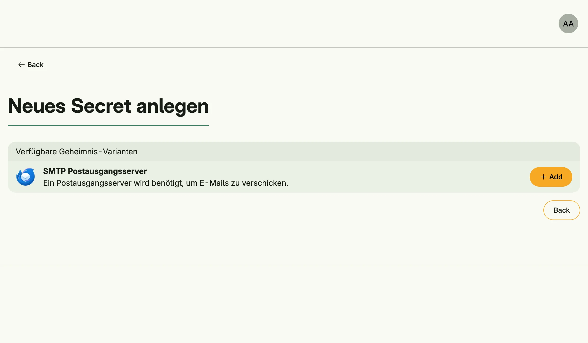

Secret Management stores credentials such as passwords, API tokens and server configurations in an encrypted
vault. A secret belongs to its owners and can be shared with groups. Other systems look up their credentials
here: [Mail](../mail_management/) uses SMTP secrets, [AI](../ai_management/), [SMS](../sms_management/) and
[Chatbot](../chatbot_management/) use the secrets of their providers.



## Enable

```go
secrets := std.Must(cfg.SecretManagement()) // application.SecretManagement
```

Secret Management is always enabled, because Mail Management depends on it. It enables User and Group
Management and loads the master key. The vault is encrypted with this key, see
[Backup Management](../backup_management/).

`application.SecretManagement` has the fields `UseCases secret.UseCases` and `Pages uisecret.Pages` with the
paths `Vault`, `CreateSecret` and `EditSecret`.

## Sharing with the system

Systems which run in the background read secrets as the system user from the group *System*
(`group.System`). To let a system use a secret, share the secret with that group.

## Custom secret types

A secret type is a struct which implements `secret.Credentials` and is registered as an enum variant. Its
exported fields become the form fields:

```go
type MyAPI struct {
	_     struct{} `credentialName:"My API" credentialDescription:"Access to my API."`
	Name  string
	Token string
}

func (MyAPI) Credentials() bool    { return true }
func (m MyAPI) GetName() string    { return m.Name }
func (m MyAPI) IsZero() bool       { return m == MyAPI{} }

var _ = enum.Variant[secret.Credentials, MyAPI]()
```

The tag can also set `credentialLogo` (an image URL) and `credentialHidden:"true"`. Find the best matching
secret of a type with the use case `Match`.

## Use cases

| Use case               | Description                                                                   |
|------------------------|-------------------------------------------------------------------------------|
| `FindMySecrets`        | Lists the secrets the subject owns or which are shared with its groups.       |
| `FindMySecretByID`     | Loads an accessible secret.                                                   |
| `CreateSecret`         | Creates a secret owned by the subject.                                        |
| `UpdateMyCredentials`  | Replaces the credentials of an accessible secret.                             |
| `UpdateMySecretGroups` | Sets the groups a secret is shared with.                                      |
| `UpdateMySecretOwners` | Changes the owners of a secret.                                               |
| `DeleteMySecretByID`   | Deletes an accessible secret.                                                 |
| `FindGroupSecrets`     | Lists all secrets of a group the subject belongs to.                          |
| `Match`                | Finds the best accessible secret of a credentials type.                       |

Owners and group members have full access; there is no read-only sharing.

## Permissions

| Permission                       | Allows to                         |
|----------------------------------|-----------------------------------|
| `nago.secret.find_my_secrets`    | list own and shared secrets       |
| `nago.secret.create`             | create secrets                    |
| `nago.secret.credentials.update` | update credentials                |
| `nago.secret.groups.update`      | share secrets with groups         |
| `nago.secret.owners.update`      | change owners                     |
| `nago.secret.delete`             | delete secrets                    |

## UI

`admin/secret/vault` lists the secrets, `admin/secret/create` offers the available secret types and
`admin/secret/edit` edits a secret. The admin center shows the card *Tresor und Geheimnisverwaltung* in the
group *Tresor & Fremdsysteme*.
