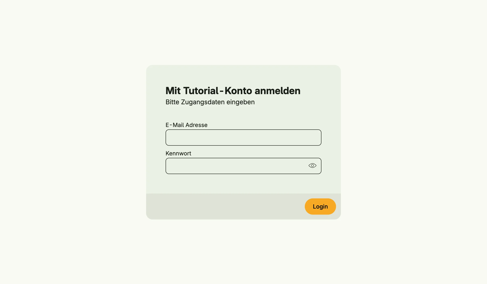

Session Management handles login, logout and the authentication state of a client. A session is identified by
a cookie and survives tabs and restarts of the device. It supports login with mail and password and single
sign-on through the Nago Login Service (NLS).



## Enable

```go
std.Must(cfg.Authentication())
// or
sessions := std.Must(cfg.SessionManagement()) // application.SessionManagement
```

Session Management is mandatory: the application panics at startup if it cannot be enabled. It enables
[Permission](../permission_management/), [Admin](../admin_management/), [Mail](../mail_management/),
[User](../user_management/) and [Settings](../settings_management/) Management, and through them
[Role](../role_management/), [Group](../group_management/), [Secret](../secret_management/),
[Template](../template_management/) and [Image](../image_management/) Management.

`application.SessionManagement` has the fields `UseCases session.UseCases` and `Pages uisession.Pages` with
the paths `Login`, `Logout` and `Authentication`.

## Use cases

| Use case              | Description                                                                  |
|-----------------------|------------------------------------------------------------------------------|
| `FindSessionByID`     | Loads a persisted session.                                                   |
| `FindUserSessionByID` | Returns a session without necessarily persisting it, e.g. for anonymous users. |
| `Login`               | Authenticates a session with mail and password.                              |
| `LoginUser`           | Marks a session as authenticated for a user ID, without any checks.         |
| `Logout`              | Logs a session out.                                                          |
| `Clear`               | Removes all sessions, only for fixing session problems.                      |
| `StartNLSFlow`        | Starts a single sign-on flow and returns the URL of the Nago Login Service.  |
| `ExchangeNLS`         | Completes the single sign-on flow.                                           |

After a successful login the event `session.Authenticated` is published.

## Permissions

Session Management declares no permissions.

## Configuration

- Sessions are stored encrypted with the master key, see [Backup Management](../backup_management/).
- The session cookie is secure unless the application runs in debug mode or `NO_SSL=true` is set.
- The login page offers registration and password reset depending on the user settings
  (`SelfRegistration`, `SelfPasswordReset`), see [User Management](../user_management/).
- Single sign-on is configured in the same settings (`SSONLSServer` and related fields).

## UI

| Path                         | Page                          |
|------------------------------|-------------------------------|
| `account/login`              | login                         |
| `account/logout`             | logout                        |
| `account/nls/authentication` | callback of the SSO flow      |

## Related

- [Tutorial: built-in IAM](/docs/examples/tutorial-26-buildin-iam/)
- [Tutorial: SSO](/docs/examples/tutorial-75-sso/)
