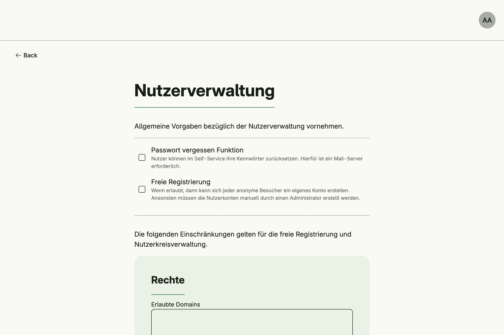

Settings Management stores global settings: one instance per settings type for the whole application. Other
systems keep their configuration here, for example the user settings (registration, password reset, consents,
single sign-on) and the theme. Every settings type gets a form in the admin center, generated from its struct.



## Enable

```go
settingsMgmt := std.Must(cfg.SettingsManagement()) // application.SettingsManagement
```

Settings Management is always enabled, because User Management depends on it. It has the fields
`UseCases settings.UseCases` and `Pages uisettings.Pages` with the path `PageSettings`.

## Declare your own settings

A settings type is a struct which implements `settings.GlobalSettings` and is registered as an enum variant.
The zero value must be a valid configuration. The tags of the blank field set the title and description of
the admin card:

```go
type MySettings struct {
	_          any    `title:"My module" description:"Settings of my module."`
	Greeting   string `label:"Greeting" supportingText:"Shown on the start page."`
	MaxEntries int    `label:"Maximum entries"`
}

func (MySettings) GlobalSettings() bool { return true }

var _ = enum.Variant[settings.GlobalSettings, MySettings]()
```

Read and write settings with the generic helpers. They run as the system user, so they bypass the permission
check, and only log errors:

```go
s := settings.ReadGlobal[MySettings](settingsMgmt.UseCases.LoadGlobal)
s.Greeting = "Hello"
settings.WriteGlobal(settingsMgmt.UseCases.StoreGlobal, s)
```

Call `LoadGlobal` and `StoreGlobal` directly to check the permissions of a subject and handle errors.

## Use cases

| Use case      | Description                                                                     |
|---------------|---------------------------------------------------------------------------------|
| `LoadGlobal`  | Loads the global instance of a settings type, or its zero value.                |
| `StoreGlobal` | Saves a global settings instance and publishes `settings.GlobalSettingsUpdated`. |

`LoadMySettings` and `StoreMySettings` for per-user settings are declared but not implemented yet.

## Permissions

| Permission                  | Allows to             |
|-----------------------------|-----------------------|
| `nago.settings.global.load` | view global settings  |
| `nago.settings.global.store`| save global settings  |

## UI

The admin center group *Einstellungen* has a card per settings type, which opens
`admin/settings/global?type=<id>` with a generated form.

## Related

- [Tutorial: settings](/docs/examples/tutorial-50-settings/) declares its own settings type.
- [Tutorial: custom font](/docs/examples/tutorial-60-customfont/) writes the theme settings.
