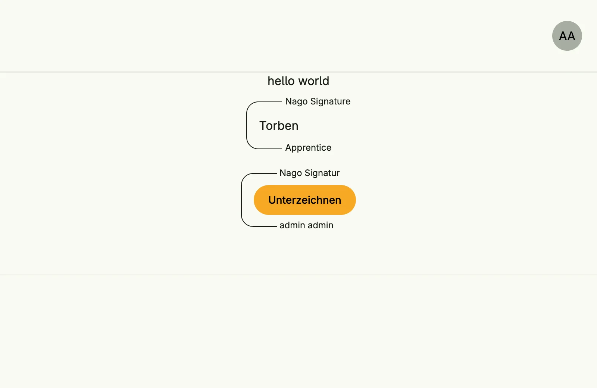

Signature Management records electronic signatures of users on resources of your application. Signatures are
unqualified electronic signatures: they do not have the legal weight of a qualified signature, but each one is
stored in a hash chain, so later changes are detectable, and it is bound to the signed resources and the
signing account. Users can deposit an image of their handwritten signature.



## Enable

```go
import cfgsignature "go.wdy.de/nago/application/signature/cfg"

signatures := std.Must(cfgsignature.Enable(cfg)) // cfgsignature.Management
```

`cfgsignature.Management` has the fields `UseCases signature.UseCases` and `Pages uisignature.Pages` with the
path `MyImageSignature`. The system adds the handwriting font *Caveat* to the theme fonts.

## Sign in the UI

`uisignature.UserSignature` shows a signature field for a resource. Before signing it shows a button, after
signing the name or signature image of the signer:

```go
uisignature.UserSignature(wnd, wnd.Subject().ID(), user.Resource{Name: "my.app.contract", ID: string(contractID)})
```

## Use cases

| Use case                     | Description                                                              |
|------------------------------|--------------------------------------------------------------------------|
| `SignUnqualifiedWithSubject` | Signs resources as the authenticated subject.                            |
| `SignUnqualified`            | Signs resources with name and mail, without an account, e.g. on a shared device. |
| `FindSignaturesByUser`       | Lists the signatures of a user; own signatures are always allowed.       |
| `FindSignaturesByResource`   | Lists the signatures of a resource.                                      |
| `FindByID`                   | Loads a signature.                                                       |
| `LoadUserSettings`, `UpdateUserSettings` | Read and change the own signature image.                     |

## Permissions

| Permission                       | Allows to                              |
|----------------------------------|----------------------------------------|
| `nago.signature.find_by_user`    | list the signatures of other users     |
| `nago.signature.find_by_resource`| list the signatures of a resource      |
| `nago.signature.find_by_id`      | view a signature                       |

Signing itself only requires a valid subject.

## UI

Every signed-in user finds the card *Meine Unterschrift* in the admin center group
*Elektronische Signaturen*. It opens `admin/my-signature/settings`, where the user draws their signature
image.

## Related

- [Tutorial: e-signature](/docs/examples/tutorial-69-esignature/)
