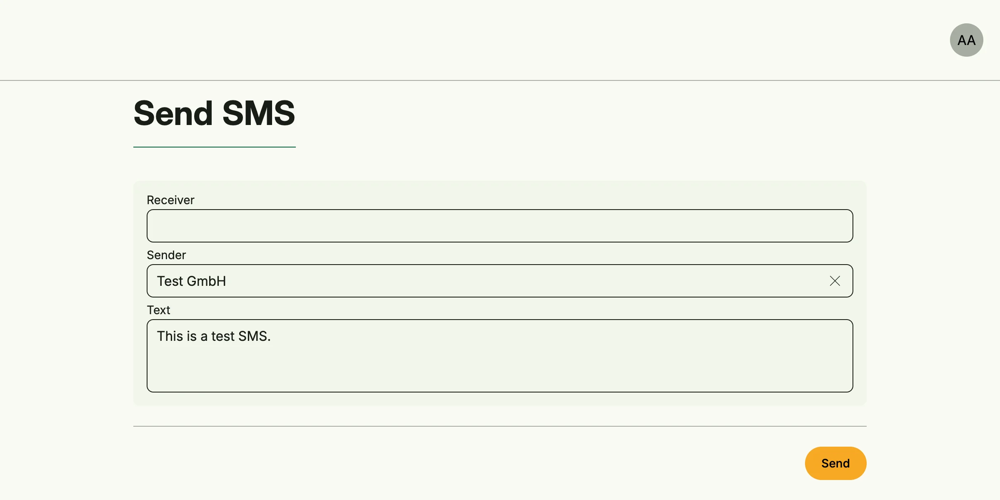

SMS Management sends text messages through an SMS provider, currently Spryng. Messages which cannot be sent
immediately are queued and retried in the background. Administrators see the queue and can send a test SMS.



## Enable

```go
import cfgsms "go.wdy.de/nago/application/sms/cfg"

smsMgmt := std.Must(cfgsms.Enable(cfg)) // cfgsms.Management
```

SMS Management enables [Secret Management](../secret_management/). `cfgsms.Management` has the fields
`UseCases sms.UseCases` and `Pages uisms.Pages` with the paths `Queue` and `Send`.

## Configure a provider

Create a secret of the type *Spryng SMS* with the API token in the vault and share it with the group
*System*. If several providers exist, `ProviderHint` selects one by name or ID.

## Send an SMS

```go
recipient := std.Must(message.NewMSISDN("+49 170 1234567"))
_, err := smsMgmt.UseCases.Send(subject, message.SendRequested{
	Recipient:  recipient,
	Originator: "MyApp",
	Body:       "Your appointment is tomorrow at 10:00.",
}, sms.SendOptions{})
if err != nil {
	return err
}
```

The originator has at most 11 alphanumeric characters or 14 digits. Without a provider or on failure the
message is queued, unless `SendOptions.NoQueue` is set. Publishing a `message.SendRequested` on the event bus
sends it as the system user. Sent messages are removed after 7 days.

## Use cases

| Use case            | Description                                                  |
|---------------------|--------------------------------------------------------------|
| `Send`              | Sends an SMS or queues it.                                   |
| `FindAllMessageIDs` | Lists the stored messages (queue and history).               |
| `FindMessageByID`   | Loads a stored message.                                      |
| `DeleteMessageByID` | Deletes a stored message.                                    |
| `ReloadProvider`    | Rebuilds the providers from the vault, also done automatically. |

## Permissions

| Permission                          | Allows to               |
|-------------------------------------|-------------------------|
| `nago.sms.provider.send`            | send SMS                |
| `nago.sms.provider.find_all_idents` | list stored messages    |
| `nago.sms.provider.find_by_id`      | view a stored message   |
| `nago.sms.provider.delete_by_id`    | delete stored messages  |
| `nago.sms.provider.reload`          | reload the providers    |

## UI

`admin/sms/queue` shows the stored messages, `admin/sms/send` sends a test SMS. The admin center shows them in
the group *SMS* as *Maintenance* and *Send SMS*.

## Related

- [Tutorial: SMS](/docs/examples/tutorial-81-sms/)
- [Chatbot Management](../chatbot_management/) sends chat messages in the same way.
