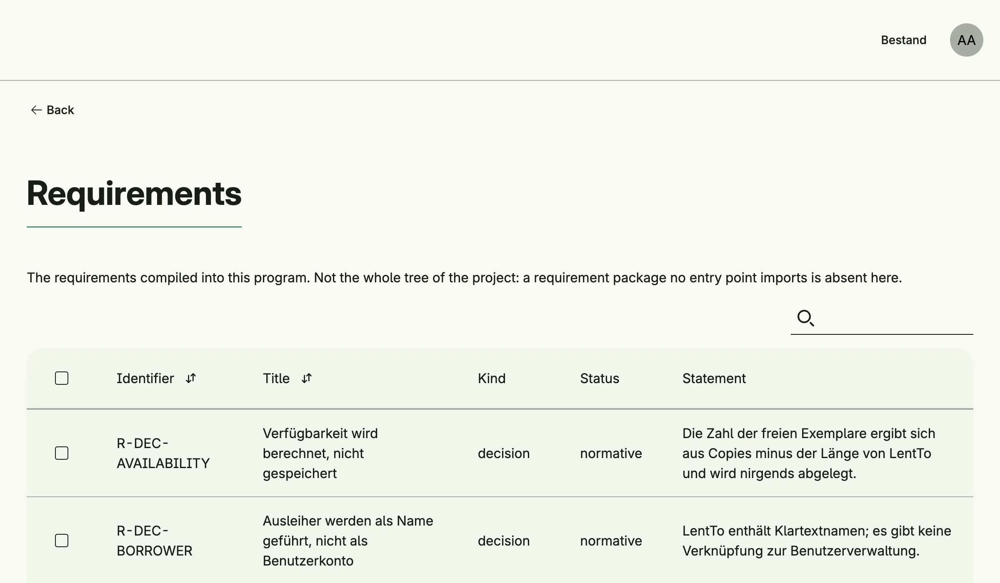

Speclink makes the requirements of your application browsable at runtime. Requirements are written as Go
files with `spec.Declare` from `github.com/worldiety/speclink/spec` and compiled into the binary; only the
requirement packages which are linked appear. Administrators browse them in the admin center, and the
[AI assistant](../ai_management/) can read them through tools.



## Enable

```go
import cfgspeclink "go.wdy.de/nago/application/speclink/cfg"

spec := std.Must(cfgspeclink.Enable(cfg)) // cfgspeclink.Management
```

The optional `cfgspeclink.Options{SourceDocuments: fsys}` adds the documents the requirements were derived
from, usually an `embed.FS`. `cfgspeclink.Management` has the fields `UseCases speclink.UseCases` and
`Pages uispeclink.Pages` with the path `Requirements`. Speclink declares the system role
*Requirements Reader*.

## Use with the AI assistant

`aispeclink.Tools(spec.UseCases)` from `go.wdy.de/nago/application/speclink/ai` returns tools to list and read
requirements, capabilities and source documents; `aispeclink.Index(subject, spec.UseCases)` returns an index
for the system prompt.

## Use cases

| Use case               | Description                                                                     |
|------------------------|---------------------------------------------------------------------------------|
| `FindAllRequirements`  | Lists the requirements, filtered and limited by their disclosure level.         |
| `FindRequirementByID`  | Loads a requirement.                                                            |
| `FindAllCapabilities`  | Lists what the binary can do, derived from the bindings to the requirements.    |
| `FindSourceDocument`   | Loads a source document.                                                        |

## Permissions

| Permission                               | Allows to                               |
|------------------------------------------|-----------------------------------------|
| `nago.speclink.requirement.find_all`     | list requirements                       |
| `nago.speclink.requirement.find_by_id`   | read a requirement                      |
| `nago.speclink.capability.find_all`      | list capabilities                       |
| `nago.speclink.source.find_by_id`        | read source documents                   |
| `nago.speclink.requirement.read_internal`| read internal, not only public, requirements |

The system role `nago.speclink.reader` contains the four find permissions, but not `read_internal`.

## UI

`admin/speclink/requirements` lists the requirements. The admin center shows the card *Requirements* in the
group *Specification*.

## Related

- [speclink](/docs/speclink/) explains the requirement files and the tool which checks them.
- [Tutorial: AI assistant](/docs/examples/tutorial-113-ai-assistant/) declares requirements and binds them to
  code.
