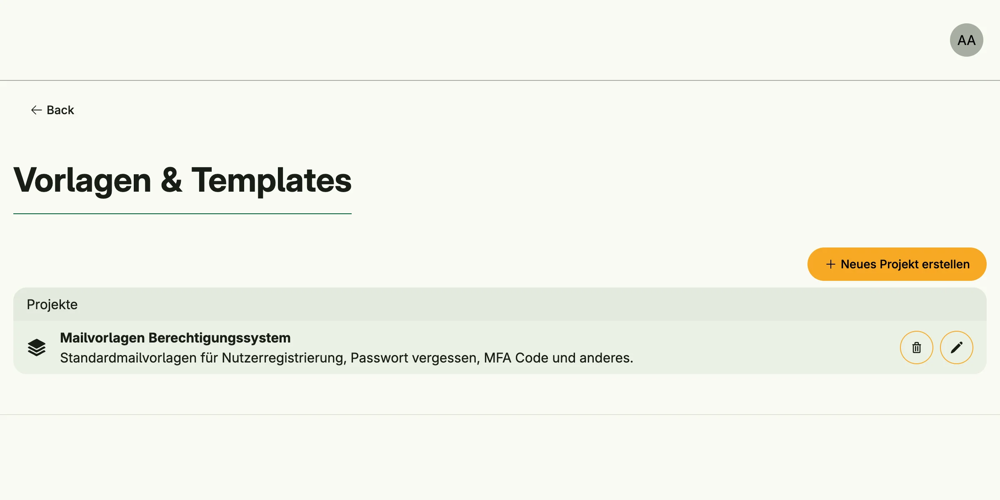

Template Management stores templates as projects of files which administrators can edit at runtime. It
separates texts and layouts from code, for example the mails of [Mail Management](../mail_management/), and
renders Go templates as plain text or HTML, or PDF documents with Typst.



## Enable

```go
templates := std.Must(cfg.TemplateManagement()) // application.TemplateManagement
```

Template Management is always enabled, because Mail Management depends on it. It has the fields
`UseCases template.UseCases` and `Pages uitemplate.Pages` with the paths `Projects`, `NewProject` and
`Editor`.

## Render a template

The configurator renders a named template of a project into a string, as the given subject:

```go
text, err := cfg.TemplateString(subject, projectID, "body", model)
```

`Execute` renders a whole project and returns a reader. Localized files below `locales/<language>/` override
the default files for `ExecOptions.Language`. The execution type of a project decides the output:

| Exec type           | Output                                      |
|---------------------|---------------------------------------------|
| `TreeTemplatePlain` | text, Go `text/template`                    |
| `TreeTemplateHTML`  | HTML; files ending in `.gohtml` are escaped |
| `TypstPDF`          | PDF, requires the `typst` binary on `PATH`  |
| `Unprocessed`       | the files as a zip                          |

`LatexPDF` and `AsciidocPDF` are declared, but currently also rendered with Typst.

`template.Apply(subject, fsys, execType, opts)` renders templates from an `fs.FS` of your code without the
system, e.g. embedded Typst files.

Ship default templates with your application with `EnsureBuildIn`, which creates a project if it does not
exist yet.

## Use cases

| Use case                         | Description                                                    |
|----------------------------------|----------------------------------------------------------------|
| `FindAll`                        | Lists the projects readable by the subject, filtered by tags.  |
| `FindByID`                       | Loads a project.                                               |
| `Execute`                        | Renders a project.                                             |
| `FSExecute`                      | Renders templates from an `fs.FS` provided by code.            |
| `Create`, `Delete`               | Create or delete a project.                                    |
| `EnsureBuildIn`                  | Creates a built-in project if it does not exist.               |
| `LoadProjectBlob`, `CreateProjectBlob`, `UpdateProjectBlob`, `RenameProjectBlob`, `DeleteProjectBlob` | Manage the files of a project. |
| `AddRunConfiguration`, `RemoveRunConfiguration` | Manage example models for previews.           |
| `ExportZip`, `ImportZip`         | Export or import a project as a zip.                           |

## Permissions

| Permission                             | Allows to                    |
|----------------------------------------|------------------------------|
| `nago.template.find_all`               | list templates               |
| `nago.template.find_by_id`             | view a template              |
| `nago.template.execute`                | render templates             |
| `nago.template.create`                 | create projects              |
| `nago.template.delete`                 | delete projects              |
| `nago.template.ensure_build_in`        | create built-in projects     |
| `nago.template.project.blob.load`      | view project files           |
| `nago.template.project.blob.create`    | create project files         |
| `nago.template.project.blob.update`    | update project files         |
| `nago.template.project.blob.rename`    | rename project files         |
| `nago.template.project.blob.delete`    | delete project files         |
| `nago.template.project.runcfg.add`     | add run configurations       |
| `nago.template.project.runcfg.remove`  | remove run configurations    |
| `nago.template.project.export`         | export projects              |
| `nago.template.project.import`         | import projects              |

## UI

`admin/template/projects` lists the projects, optionally filtered with `?tag=`, `admin/template/new` creates
one and `admin/template/edit` edits its files. The admin center shows the cards *E-Mail Vorlagen*,
*PDF Vorlagen* and *Alle Vorlagen* in the group *Vorlagen & Templates*.

## Related

- [Tutorial: templates](/docs/examples/tutorial-37-template/) enables the system.
- [Tutorial: Typst template](/docs/examples/tutorial-71-template/) renders an embedded Typst template into a PDF.
