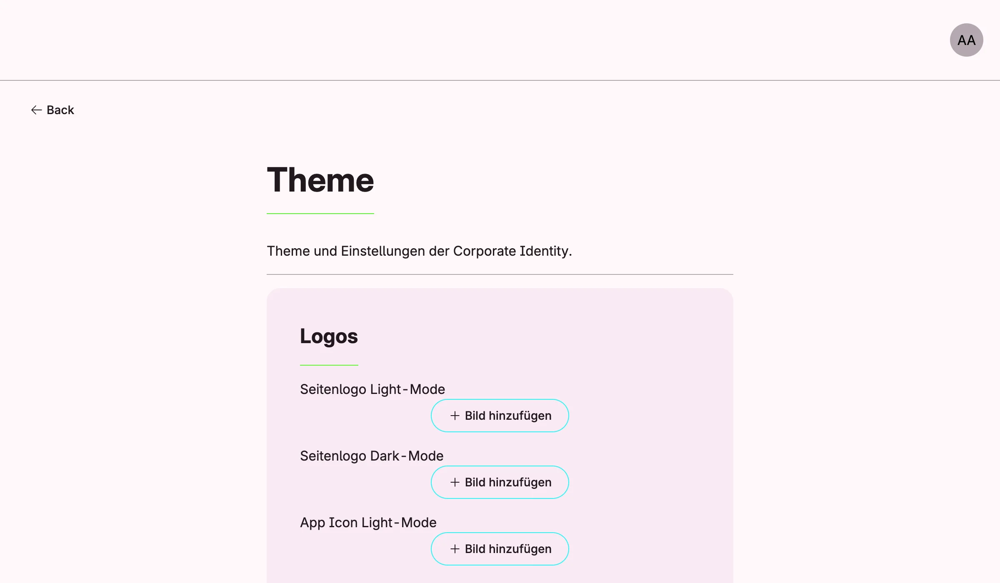

Theme Management holds the corporate identity of the application: the colors for light and dark mode, the
fonts, logos and app icons, legal links (imprint, privacy policy, terms) and the provider contact. Colors and
fonts are applied to all windows, changes made through the use cases are applied live.



## Enable

```go
themes := std.Must(cfg.ThemeManagement()) // application.ThemeManagement
```

Theme Management is always enabled when the application starts; call it only to get its use cases.
`application.ThemeManagement` has the single field `UseCases theme.UseCases`. The data is stored as the global
settings type `theme.Settings`, see [Settings Management](../settings_management/).

## Set the colors

Derive full color sets from three base colors and store them once:

```go
themes := std.Must(cfg.ThemeManagement())
if !std.Must(themes.UseCases.HasColors(user.SU())) {
	base := theme.BaseColors{Main: "#1B8C30", Interactive: "#F7A823", Accent: "#03613D"}
	option.MustZero(themes.UseCases.UpdateColors(user.SU(), theme.Colors{
		Dark:  themes.UseCases.Calculations.DarkMode(base),
		Light: themes.UseCases.Calculations.LightMode(base),
	}))
}
```

Without stored colors, Nago derives them from `theme.DefaultBaseColors`. The stored theme colors override the
core color set registered with `cfg.ColorSet`; use `cfg.ColorSet` for your own color namespaces.

## Use cases

| Use case       | Description                                                                         |
|----------------|-------------------------------------------------------------------------------------|
| `Calculations` | Functions which derive color sets (`DarkMode`, `LightMode`, `TrueDarkMode`, `TrueLightMode`) from base colors. |
| `UpdateColors` | Stores the colors for dark and light mode and applies them.                         |
| `ReadColors`   | Returns the stored colors or the default ones.                                      |
| `HasColors`    | Reports whether valid colors are stored.                                            |
| `ResetColors`  | Removes the stored colors; takes effect after a restart.                            |
| `UpdateFonts`  | Stores the global fonts and applies them.                                           |
| `ReadFonts`    | Returns the global fonts.                                                           |

## Permissions

| Permission                 | Allows to           |
|----------------------------|---------------------|
| `nago.theme.colors.read`   | read the colors     |
| `nago.theme.colors.update` | update the colors   |

## UI

Logos, legal links, provider data and slogan are edited in the admin center under *Einstellungen* → *Theme*.
Colors and fonts have no form yet, set them in code. Changes made in the settings form take effect after a
restart.

## Related

- [Tutorial: theme](/docs/examples/tutorial-55-theme/) sets and resets the colors.
- [Tutorial: custom font](/docs/examples/tutorial-60-customfont/) sets the fonts.
- [Tutorial: colors](/docs/examples/tutorial-08-colors/) registers a custom color namespace.
