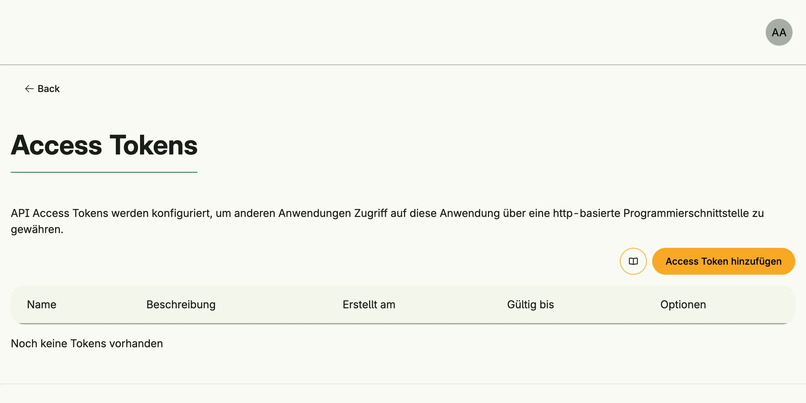

Token Management issues API access tokens. Other applications use a token to call your REST endpoints as an
authenticated subject. Like a user, a token can carry roles, groups and permissions.



## Enable

```go
tokens := std.Must(cfg.TokenManagement()) // application.TokenManagement
```

Token Management is not part of `StandardSystems`. It enables User, Group and Role Management and registers
tokens as a [ReBAC](../rebac_management/) resource. `application.TokenManagement` has the fields
`UseCases token.UseCases` and `Pages uitoken.Pages` with the path `Tokens`.

## Protect an endpoint

Use `AuthenticateSubject` with `hapi.BearerAuth` to resolve the bearer token of a request into a subject, see
[REST APIs](../hapi_management/):

```go
hapi.Post[Request](api, hapi.Operation{Path: "/api/v1/events"}).
	Request(
		hapi.BearerAuth[Request](tokens.UseCases.AuthenticateSubject, func(dst *Request, subject auth.Subject) error {
			dst.Subject = subject
			return nil
		}),
	).
	Response(hapi.ToJSON[Request, Response](handleEvent))
```

`handleEvent` checks the permissions of `in.Subject` like any other use case. A request without an
`Authorization` header gets an anonymous subject.

## Use cases

| Use case              | Description                                                                          |
|-----------------------|--------------------------------------------------------------------------------------|
| `Create`              | Creates a token. The plaintext is returned once and never stored.                    |
| `Rotate`              | Issues a new secret for a token and keeps its settings.                              |
| `Delete`              | Deletes a token; a subject can always delete its own tokens.                         |
| `FindAll`             | Lists the visible tokens.                                                            |
| `FindByID`            | Loads a token.                                                                       |
| `AuthenticateSubject` | Returns the subject of a plaintext token; it is invalid if the token is unknown or expired. |

`ResolveTokenRights` is deprecated, use the ReBAC API.

## Permissions

| Permission                     | Allows to                     |
|--------------------------------|-------------------------------|
| `nago.token.create`            | create tokens                 |
| `nago.token.rotate`            | rotate tokens                 |
| `nago.token.delete`            | delete tokens                 |
| `nago.token.find_all`          | list tokens                   |
| `nago.token.resolve_token_rights` | view the rights of a token |

## UI

The page `admin/iam/tokens` creates, rotates and deletes tokens. The admin center shows the card
*Access Token* in the group *Access Tokens* to users with `nago.token.find_all`.

## Related

- [Tutorial: REST](/docs/examples/tutorial-56-rest/)
