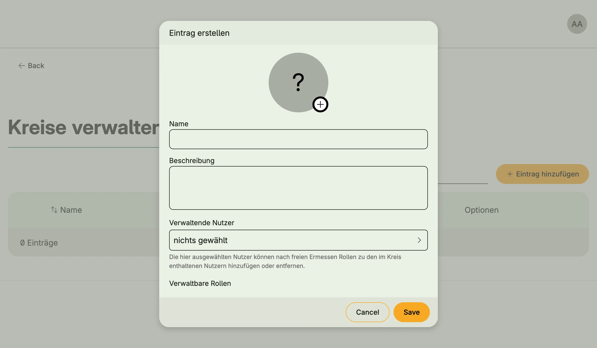

User circles delegate user administration. A circle is a subset of users, defined by rules such as mail
domains, roles or groups. Its administrators can manage the members of the circle without being global
administrators: assign the roles and groups the circle allows, enable, disable or verify accounts, or delete
them.



## Enable

```go
import cfgusercircle "go.wdy.de/nago/application/usercircle/cfg"

circles := std.Must(cfgusercircle.Enable(cfg)) // cfgusercircle.Management
```

User circles enable User, Role and Group Management. `cfgusercircle.Management` has the fields
`UseCases usercircle.UseCases` and `Pages uiusercircles.Pages`.

## Circles

A circle (`usercircle.Circle`) has a name, description and avatar, and:

- `Administrators`: the users who manage the circle,
- `Roles`, `Groups`: the roles and groups the administrators may assign,
- `CanDelete`, `CanDisable`, `CanEnable`, `CanVerify`: what the administrators may do with accounts,
- member rules: `MemberRuleUsers`, `MemberRuleDomains` (e.g. `@example.com`), `MemberRuleRoles`,
  `MemberRuleGroups` and `MemberRuleUsersBlacklist`.

## Use cases

| Use case                         | Description                                                    |
|----------------------------------|----------------------------------------------------------------|
| `Create`, `Update`, `DeleteByID` | Manage circles.                                                |
| `FindAll`, `FindByID`            | Load circles.                                                  |
| `MyCircles`                      | Lists the circles the subject administers.                     |
| `MyCircleMembers`                | Lists the members of a circle.                                 |
| `IsMyCircleMember`, `IsCircleAdmin` | Check membership and administration.                        |
| `MyRoles`, `MyGroups`            | List the roles and groups a circle may assign.                 |
| `MyCircleRolesAdd`, `MyCircleRolesRemove` | Assign or remove roles of a member.                   |
| `MyCircleGroupsAdd`, `MyCircleGroupsRemove` | Assign or remove groups of a member.                |
| `MyCircleUserUpdateStatus`       | Enables or disables a member.                                  |
| `MyCircleUserVerified`           | Marks the mail address of a member as verified.                |
| `MyCircleUserRemove`             | Deletes a member.                                              |

## Permissions

| Permission                  | Allows to          |
|-----------------------------|--------------------|
| `nago.usercircle.create`    | create circles     |
| `nago.usercircle.update`    | update circles     |
| `nago.usercircle.find_by_id`| view a circle      |
| `nago.usercircle.find_all`  | list all circles   |
| `nago.usercircle.delete`    | delete circles     |

The `MyCircle*` use cases need no permission; they check that the subject is an administrator of the circle.

## UI

`admin/user/circles` manages the circles. Circle administrators get a card per circle in the admin center
group *Nutzerkreise*, which leads to `admin/user/my-circle` and its pages for users, roles and groups.

## Related

- [Tutorial: built-in IAM](/docs/examples/tutorial-26-buildin-iam/)
