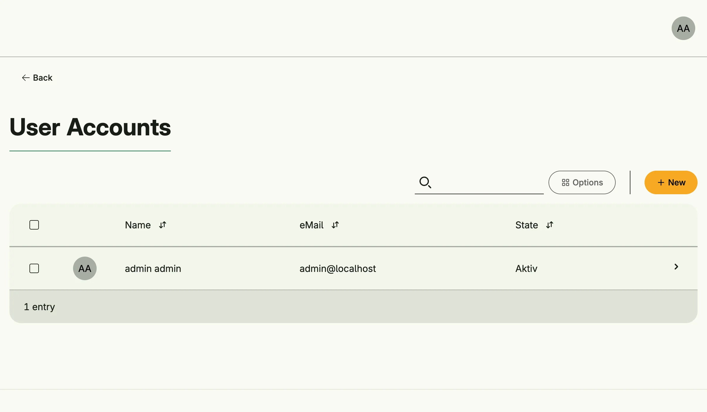

User Management stores the user accounts of your application. It covers the admin side (create, edit, disable
and delete accounts, assign roles, groups and permissions) and the self-service side (registration, profile,
contact data, password change and reset, mail verification, GDPR consents).



## Enable

```go
users := std.Must(cfg.UserManagement()) // application.UserManagement
```

You rarely call it yourself: [Session Management](../session_management/) is mandatory and enables User
Management, which in turn enables [Role](../role_management/), [Permission](../permission_management/),
[Group](../group_management/), [Settings](../settings_management/) and [Image](../image_management/)
Management.

`application.UserManagement` has two fields:

- `UseCases user.UseCases` (package `go.wdy.de/nago/application/user`)
- `Pages uiuser.Pages` with the paths `Users`, `MyProfile`, `MyContact`, `ConfirmMail`, `ResetPassword` and
  `Register`

### Bootstrap admin

A fresh installation has no users. `EnableBootstrapAdmin` creates or reactivates the account `admin@localhost`
with all `nago.*` permissions until the given time:

```go
std.Must(std.Must(cfg.UserManagement()).UseCases.EnableBootstrapAdmin(time.Now().Add(time.Hour), "%6UbRsCuM8N$auy"))
```

Permissions of your own application are not included, assign them to the admin through a role.

## Use cases

| Use case                                                                 | Description                                                                         |
|--------------------------------------------------------------------------|-------------------------------------------------------------------------------------|
| `Create`                                                                 | Creates a user, also used by the self-registration.                                 |
| `FindByID`, `FindByMail`, `FindAll`, `FindAllIdentifiers`, `CountUsers`  | Look up users.                                                                      |
| `Delete`                                                                 | Deletes an account and publishes `user.Deleted`, so that modules can remove data.   |
| `ChangeMyPassword`, `ChangeOtherPassword`, `ChangePasswordWithCode`      | Change the own password, another user's password, or reset it with a code.        |
| `ResetPasswordRequestCode`, `RequiresPasswordChange`                     | Issue a password reset code, check whether a password change is required.          |
| `ReadMyContact`, `UpdateMyContact`, `UpdateOtherContact`                 | Read and update contact data.                                                       |
| `ChangeOtherEmail`                                                       | Changes the login mail of another user, the account becomes unverified.             |
| `UpdateOtherRoles`, `UpdateOtherGroups`, `UpdateOtherPermissions`, `AddUserToGroup` | Assign roles, groups and direct permissions.                             |
| `ListRoles`, `ListGroups`, `ListGlobalPermissions`                       | Read the roles, groups and global permissions of a user.                            |
| `UpdateAccountStatus`                                                    | Enables or disables an account.                                                     |
| `ConfirmMail`, `ResetVerificationCode`, `UpdateVerification`, `UpdateVerificationByMail` | Mail verification.                                                  |
| `AuthenticateByPassword`                                                 | Checks mail and password.                                                           |
| `SubjectFromUser`, `SysUser`, `GetAnonUser`                              | Subjects for a user ID, for the system (automations, migrations) and for anonymous users. |
| `DisplayName`                                                            | Cached display name and avatar of a user.                                           |
| `EMailUsed`                                                              | Reports whether a mail address is already taken.                                    |
| `Consent`                                                                | Approves or revokes a GDPR consent.                                                 |
| `ExportUsers`                                                            | Exports users as CSV.                                                               |
| `MergeSingleSignOnUser`                                                  | Creates or updates a user from a trusted SSO login.                                 |
| `EnableBootstrapAdmin`                                                   | See above.                                                                          |

`AddResourcePermissions`, `RemoveResourcePermissions`, `ListResourcePermissions`, `GrantPermissions`,
`ListGrantedPermissions` and `ListGrantedUsers` are deprecated, use [ReBAC](../rebac_management/) instead.

The system publishes the events `user.Created`, `user.Deleted`, `user.EMailChanged`, `user.ContactUpdated`,
`user.ConsentChanged` and `user.MFACodeCreated`.

## Permissions

| Permission                          | Allows to                                  |
|-------------------------------------|--------------------------------------------|
| `nago.user.create`                  | create users                               |
| `nago.user.find_by_id`              | find a user by ID                          |
| `nago.user.find_by_mail`            | find a user by mail                        |
| `nago.user.find_all`                | list all users                             |
| `nago.user.change_other_password`   | change the password of other users         |
| `nago.user.delete`                  | delete users                               |
| `nago.user.update_other_contact`    | change the contact data of other users     |
| `nago.user.update_other_roles`      | change the roles of other users            |
| `nago.user.update_other_permissions`| change the permissions of other users      |
| `nago.user.update_other_groups`     | change the groups of other users           |
| `nago.user.update_account_status`   | enable or disable accounts                 |
| `nago.user.change_other_email`      | change the mail address of other users     |
| `nago.user.export_users`            | export users                               |
| `nago.user.consent_other`           | set consents of other users                |

## Settings

The global settings type `user.Settings` is edited in the admin center under *Einstellungen* and controls
self-registration, self-service password reset, allowed mail domains, default and anonymous roles and groups,
the GDPR consents shown at registration and in the profile, required contact fields and the single sign-on
via the Nago Login Service. See [Settings Management](../settings_management/).

## UI

| Path                      | Page                                     |
|---------------------------|------------------------------------------|
| `admin/accounts`          | user list for administrators             |
| `account/profile`         | own profile                              |
| `account/profile/contact` | own contact data                         |
| `account/register`        | self-registration                        |
| `account/confirm`         | mail confirmation                        |
| `account/password/reset`  | password reset                           |

The admin center shows the card *Konten* in the group *Nutzerverwaltung* to users with `nago.user.find_all`.

## Related

- [Tutorial: built-in IAM](/docs/examples/tutorial-26-buildin-iam/) shows the bootstrap admin, a custom
  permission and GDPR consents.
- [Tutorial: SSO](/docs/examples/tutorial-75-sso/)
