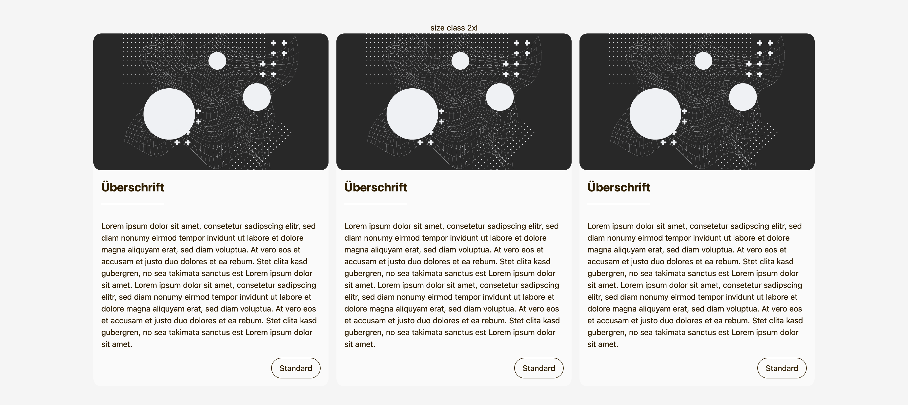
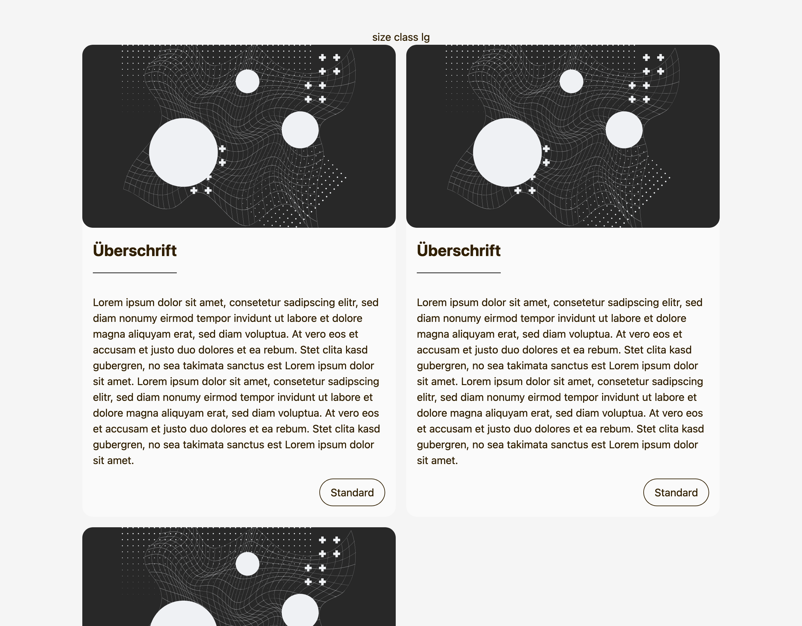
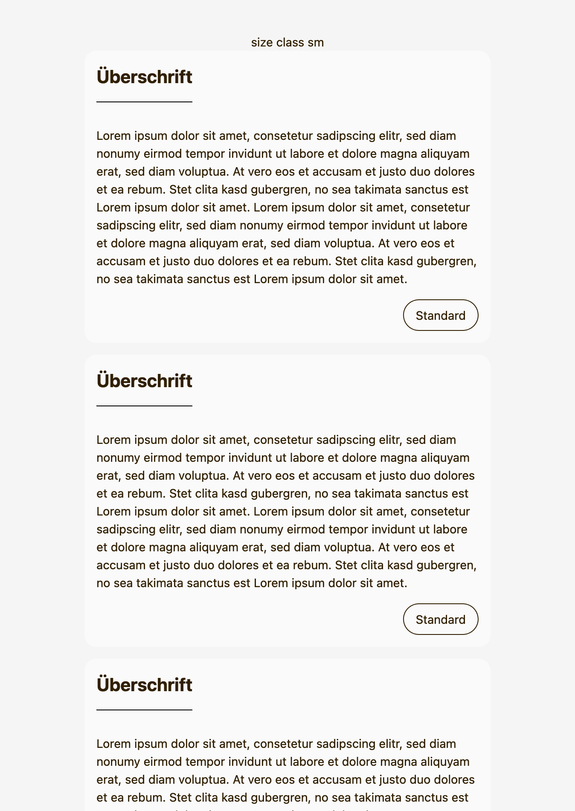

---
# Static and dynamic content mixed!
# Use the shortcode  to include the content of the file as a go-code block.
title: Tutorial 06
prev: /docs/examples/tutorial-05-gantt-grid
next: /docs/examples/tutorial-07-dialog
---

Write some static content.

## Example


## Info
More static content.

## Image

