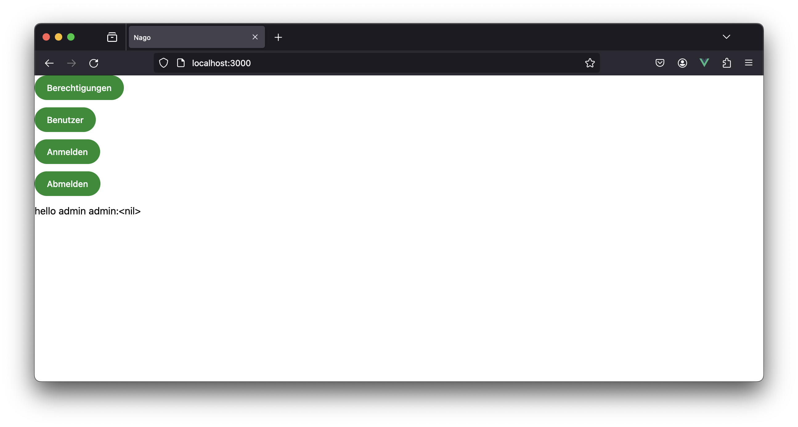
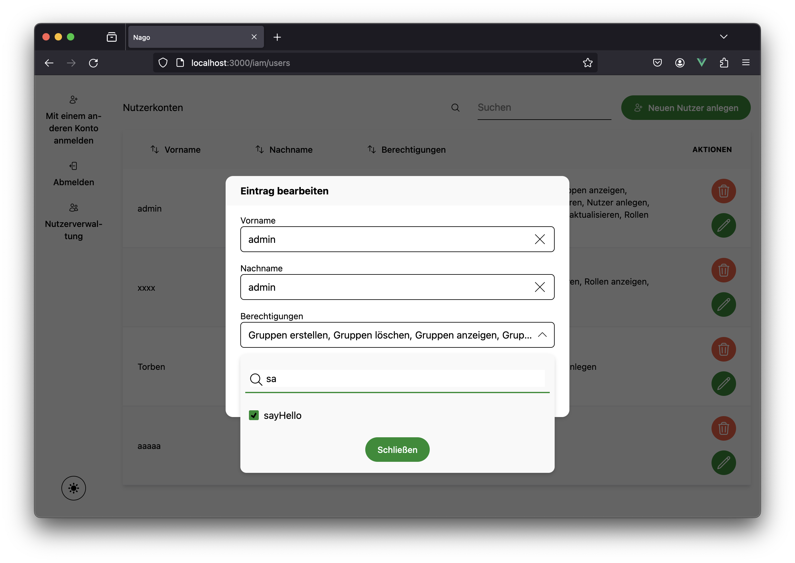

# Identity und Access Management

Die Implementierung hat ein integriertes Authentifizierungs- und Autorisierungssystem.
Grundsätzlich ist das System darauf ausgelegt, dass die Wahrheit über die Identität eines Nutzers im System selbst liegt.
Das bleibt auch für den Fall so, wenn die Authentifizierung über externe SSO-Anbieter wie Microsoft Entra, Login-With-Amazon oder Google erfolgt.
Hintergrund ist, dass solche externen Nutzer üblicherweise außerhalb jeglicher Kontrolle durch uns oder den Kunden der Plattform selbst ist.
Das bedeutet, dass nicht damit gerechnet werden kann, dass der Kunde Konten deaktivieren, Gruppen oder Rollen beim SSO-Anbieter verwalten kann.
Deshalb liegt das komplette Permission, Group und Role-Management im System selbst.

Im Folgenden wird ein minimales Beispiel gezeigt, wie mit dem System gearbeitet werden kann.

Um das Projekt standardisiert zu bauen und weitere Schritte des Buildprozesses zu automatisieren ist sowieso ein Makefile praktisch.
Füge dazu den folgenden Aussschnitt deinem Makefile hinzu.
```makefile
macro:
	GOPROXY=direct go run github.com/worldiety/macro/cmd/expand@latest
```



Das System ist ein reines OptIn System, sodass natürlich auch eine komplett eigene IAM-Logik umgesetzt werden kann - empfohlen sei das an dieser Stelle aber grundsätzlich nicht.
Insbesondere sollte darauf verzichtet werden Passwörter oder Sessions zu verarbeiten.
Der vorliegende Code wurde ge-reviewed und wird zentral gepflegt. 

Schaue dir am besten die IAM-Settings genau an und was die `cfg.IAM` Methode im Detail macht, um deine Möglichkeiten der Anpassung auszunutzen.
Insbesondere sind sicherlich die `ComponentFactoryID`s und der Decorator von besonderem Interesse, damit du das IAM-System nahtlos in deine eigene Seitenstruktur einbetten kannst und es zu keinen Brüchen in Navigation und Layout kommt.

```go
// #[go.permission.generateTable]
package main

import (
	"fmt"
	"go.wdy.de/nago/application"
	"go.wdy.de/nago/auth"
	"go.wdy.de/nago/auth/iam"
	"go.wdy.de/nago/presentation/core"
	"go.wdy.de/nago/presentation/uilegacy"
	"go.wdy.de/nago/web/vuejs"
)

// sayHello greets everyone who has been authenticated.
// #[@Usecase]
// #[go.permission.audit]
func sayHello(auth auth.Subject) (string, error) {
	if err := auth.Audit("de.worldiety.tutorial.say_hello"); err != nil {
		return "invalid", err
	}

	return "hello " + auth.Name(), nil
}

func main() {
	application.Configure(func(cfg *application.Configurator) {
		cfg.SetApplicationID("de.worldiety.tutorial")
		cfg.Serve(vuejs.Dist())

		iamCfg := application.IAMSettings{}
		iamCfg.Permissions.Permissions = iam.PermissionsFrom(Permissions())
		iamCfg = cfg.IAM(iamCfg)

		cfg.Component(".", func(wnd core.Window) core.Component {
			return ui.NewVBox(func(vbox *ui.VBox) {
				vbox.Append(
					ui.NewActionButton("Berechtigungen", func() {
						wnd.Navigation().ForwardTo(iamCfg.Permissions.ID, nil)
					}),

					ui.NewActionButton("Benutzer", func() {
						wnd.Navigation().ForwardTo(iamCfg.Users.ID, nil)
					}),

					ui.NewActionButton("Anmelden", func() {
						wnd.Navigation().ForwardTo(iamCfg.Login.ID, nil)
					}),
					ui.NewActionButton("Abmelden", func() {
						wnd.Navigation().ForwardTo(iamCfg.Logout.ID, nil)
					}),
				)

				msg, err := sayHello(wnd.Subject())
				vbox.Append(ui.MakeText(fmt.Sprintf("%s:%v", msg, err)))
			})
		})
	}).Run()
}

```

