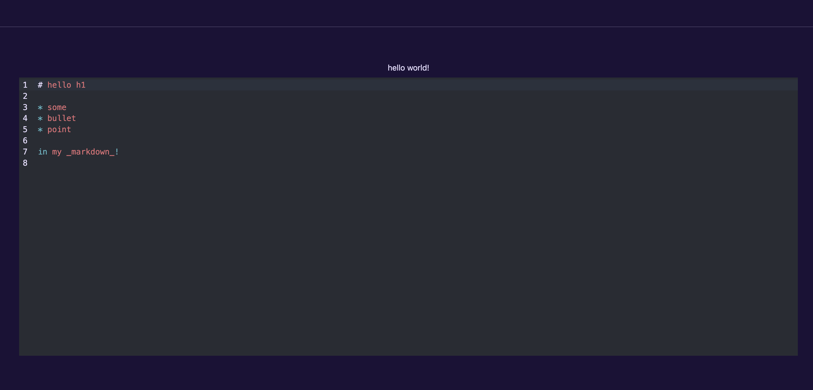

---
# Static and dynamic content mixed!
# Use the shortcode  to include the content of the file as a go-code block.
title: Tutorial 54
prev: /docs/examples/tutorial-53-countdown
next: /docs/examples/tutorial-55-theme
---

Write some static content.

## Example


## Info
More static content.

## Image

## See also
- [Code Editor](../../components/composite/code_editor)
- [Frame](../../components/layout/frame)

