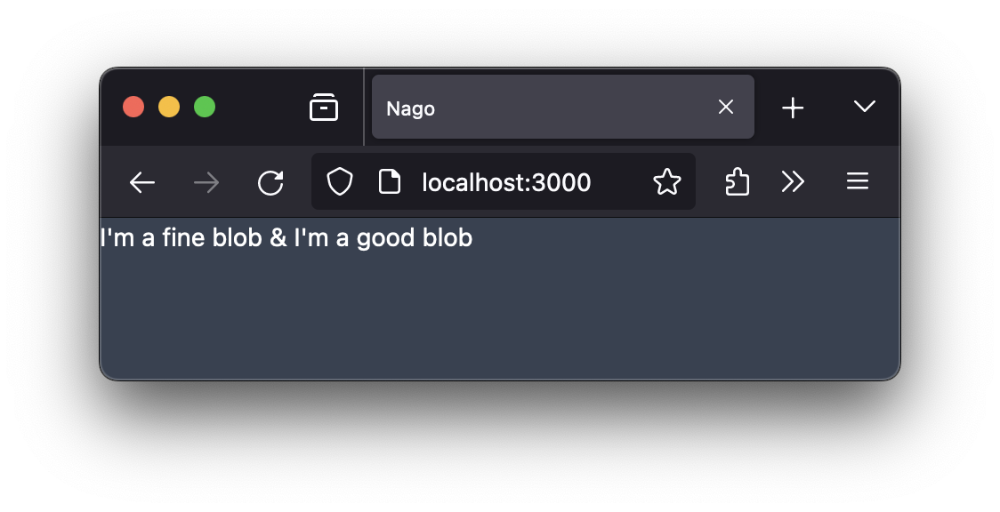

# Blobstores for small and large byte streams

Standardmäßig bietet das Framework nur die BlobStore API an.
Obwohl grundsätzlich der Zugriff auf das Dateisystem nicht eingeschränkt wird, solltest du das Dateisystem wenn möglich nie direkt benutzen.
Verwende stattdessen die BlobStore-API direkt oder mit einem der vielen Helfer-Funktionen und Typen.



Durch die Abstraktion kannst du später die Implementierung einfach austauschen und somit sehr einfach die Eigenschaften _Skalierbarkeit_ und _Integrität_ beeinflussen.
Derzeit gibt es eine [BBolt-](https://gitlab.worldiety.net/group/ora/nago/-/tree/main/pkg/blob/bolt), eine [Dateisystem-](https://gitlab.worldiety.net/group/ora/nago/-/tree/main/pkg/blob/fs) und eine [In-Memory-](https://gitlab.worldiety.net/group/ora/nago/-/tree/main/pkg/blob/mem)Implementierung.
Geplant sind zudem noch Implementierung für das worldiety S3- sowie das worldiety Cockroach-Cluster.

Um das Prototyping zu erleichtern und strukturierte Daten zu verarbeiten, gibt es noch eine [https://gitlab.worldiety.net/group/ora/nago/-/tree/main/pkg/data/json](JSON-Repository-Implementierung), die aber in einem anderen Tutorial vorgestellt wird.

```go
package main

import (
	"bytes"
	"go.wdy.de/nago/application"
	"go.wdy.de/nago/pkg/blob"
	"go.wdy.de/nago/presentation/core"
	"go.wdy.de/nago/presentation/ui"
	"go.wdy.de/nago/web/vuejs"
)

func main() {
	application.Configure(func(cfg *application.Configurator) {
		cfg.SetApplicationID("de.worldiety.tutorial")
		cfg.Serve(vuejs.Dist())

		// BlobStore is only for small files upto a few kilobytes.
		// This store saves everything within a single file using etcd bbolt fork.
		// Transactions are supported.
		//
		// In this example, the database file is ~/.de.worldiety.tutorial/bbolt/bolt.db
		dbstore := cfg.BlobStore("small-blobs")

		// quickly write some bytes using a transaction with a single write.
		if err := blob.Write(dbstore, "my key", bytes.NewBufferString("I'm a fine blob")); err != nil {
			panic(err)
		}

		// read them out
		var buf1 bytes.Buffer
		if err := blob.Read(dbstore, "my key", &buf1); err != nil {
			panic(err)
		}

		// FileStore is for large blobs, from hundreds of kilobytes to gigabytes.
		// It stores each blobs as a single file directly in the local filesystem.
		// There is no transaction support at all, however some tricks like atomic rename are used to
		// lower the risk of damaged files.
		//
		// In this example, the files land in ~/.de.worldiety.tutorial/files/my-large-blobs
		fstore := cfg.FileStore("my-large-blobs")

		// quickly write some bytes
		if err := blob.Write(fstore, "my key", bytes.NewBufferString("I'm a good blob")); err != nil {
			panic(err)
		}

		// read them out
		var buf2 bytes.Buffer
		if err := blob.Read(fstore, "my key", &buf2); err != nil {
			panic(err)
		}

		cfg.Component(".", func(wnd core.Window) core.Component {
			return ui.MakeText(buf1.String() + " & " + buf2.String())
		})
	}).Run()
}

```