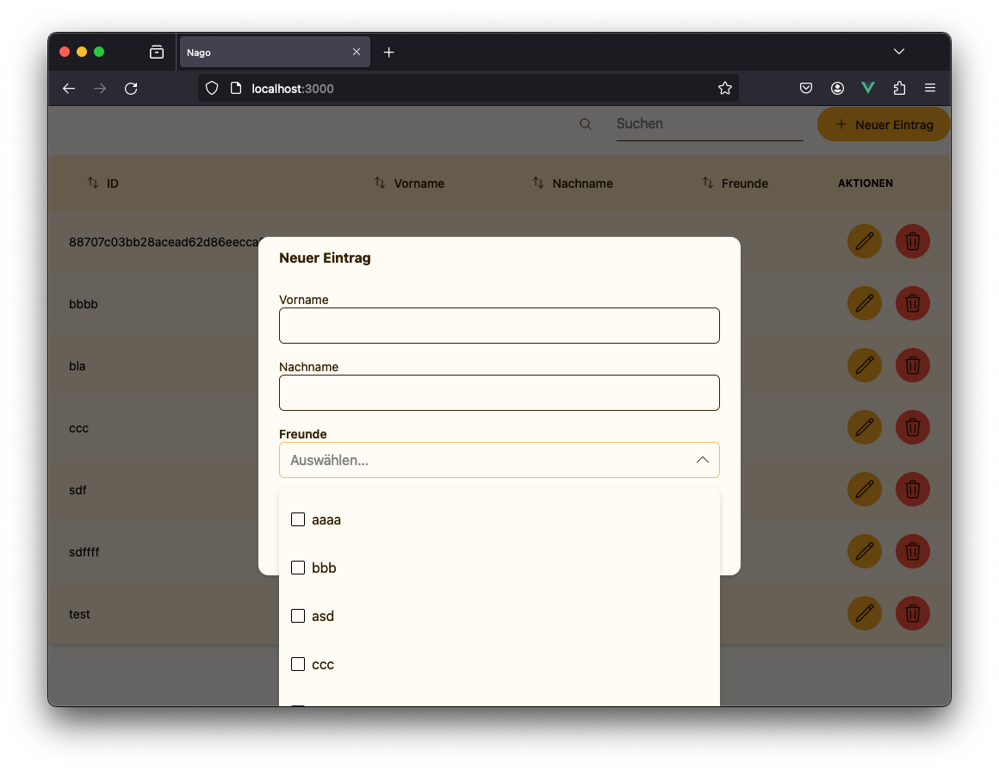

# CRUD - Create, Read, Update, Delete

Eine der häufigsten Anwendungsfälle sind Ansichten, die Entitäten oder Aggregate als Übersicht mit Funktionen zum Anlegen, Aktualisieren oder Löschen darstellen.
Das CRUD-Package abstrahiert von den konkreten Darstellungsformen und nimmt einfache Datentransformatoren entgegen, um eine Standardoberfläche für diese Anwendungsfälle zu erzeugen. 

Beachte auch die optionalen `RenderHints`, die dir einen Einfluss auf die Darstellung in den verschiedenen Konstellationen erlaubt.



Beachte bitte, dass das gezeigte Beispiel nur der Illustration dient und keinen Best-Practice darstellt.
In einer ordentlichen Schichtenarchitektur sollte die Oberfläche (also die Präsentationsschicht) nie direkt mit einem Repository arbeiten.
Erstelle stattdessen einen Anwendungsfall (entweder eine freie Funktion oder eine Servicemethode) und lasse diese die Daten zurückgeben.
Schaue dir auch das [IAM-Beispiel](https://wiki.worldiety.net/books/design-system-ora/page/identity-und-access-management) an, um Authentifikation und Autorisierung abzubilden.
In einem solchen Fall würdest du einfach eine Closure-Funktion erstellen und deinen Usecase mit den zusätzlichen Parametern aufrufen.

```go
package main

import (
	"go.wdy.de/nago/application"
	"go.wdy.de/nago/pkg/data"
	"go.wdy.de/nago/presentation/core"
	"go.wdy.de/nago/presentation/ui"
	"go.wdy.de/nago/presentation/uix/crud"
	"go.wdy.de/nago/web/vuejs"
)

type PID string
type Person struct {
	ID        PID
	Firstname string
	Lastname  string
	// this is like foreign keys, however they become stale and are not automatically updated
	// the CRUD view just ignores these cases silently and after updating an entity all unreachable
	// foreign keys are removed.
	Friends   []PID 
}

func (p Person) Identity() PID {
	return p.ID
}

type Persons data.Repository[Person, PID]

func main() {
	application.Configure(func(cfg *application.Configurator) {
		cfg.SetApplicationID("de.worldiety.tutorial")
		cfg.Serve(vuejs.Dist())

		persons := application.SloppyRepository[Person, PID](cfg)

		cfg.Component(".", func(wnd core.Window) core.Component {
			return ui.NewPage(func(page *ui.Page) {
				page.Body().Set(crud.NewView[Person](page, crud.NewOptions(func(opts *crud.Options[Person]) {
					opts.
						PrepareCreate(func(person Person) (Person, error) {
							person.ID = data.RandIdent[PID]()
							return person, nil
						}).
						Create(persons.Save).
						ReadAll(persons.Each).
						Update(persons.Save).
						Delete(persons.DeleteByEntity).
						Bind(func(bnd *crud.Binding[Person]) {
							crud.Text(bnd,
								crud.FromPtr("ID", func(model *Person) *PID {
									return &model.ID
								}, crud.RenderHints{
									crud.Create: crud.Hidden,
									crud.Update: crud.ReadOnly,
								}),
							)
							crud.Text(bnd, crud.FromPtr("Vorname", func(model *Person) *string {
								return &model.Firstname
							}))
							crud.Text(bnd, crud.FromPtr("Nachname", func(model *Person) *string {
								return &model.Lastname
							}))
							crud.OneToMany(bnd, persons.Each, func(person Person) string {
								return person.Firstname
							}, crud.FromPtr("Freunde", func(model *Person) *[]PID {
								return &model.Friends
							}))
						})

				})))
			})
		})
	}).Run()
}

```